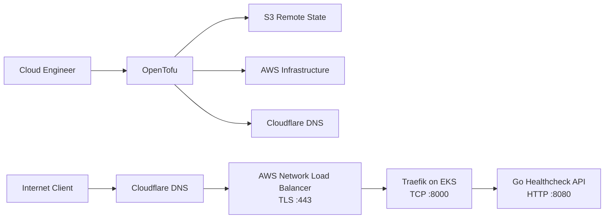
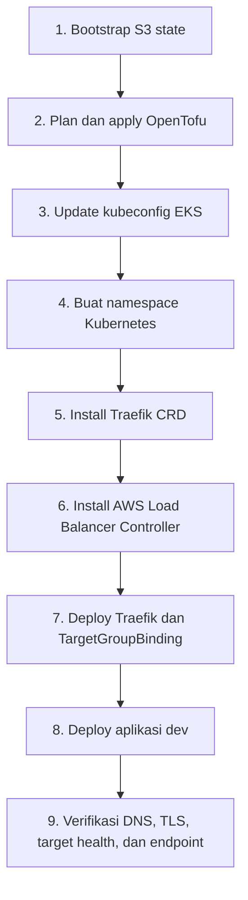

# AWS Cloud Engineering Lab

Repository ini adalah laboratorium cloud engineering untuk mempelajari desain,
provisioning, deployment, dan operasi workload di AWS. Infrastruktur dikelola
sebagai kode menggunakan OpenTofu, sedangkan workload Kubernetes dikelola
dengan manifest Kubernetes, Kustomize, dan Helm.

Fokus utama repository adalah membangun jalur lengkap dari DNS publik sampai ke
aplikasi di Amazon EKS:



## Tujuan Lab

- Mempraktikkan Infrastructure as Code dengan OpenTofu.
- Mendesain VPC multi-AZ dengan public subnet dan private subnet.
- Menjalankan managed Kubernetes menggunakan Amazon EKS.
- Menggunakan IAM role dan EKS Pod Identity untuk akses AWS dari Pod.
- Menghubungkan NLB yang dikelola OpenTofu ke Pod menggunakan
  `TargetGroupBinding`.
- Melakukan terminasi TLS di NLB menggunakan sertifikat ACM.
- Mengelola DNS dan validasi sertifikat melalui Cloudflare.
- Menjalankan ingress controller dan aplikasi dengan manifest Kubernetes.
- Memahami lifecycle plan, apply, verification, dan destroy sebuah environment.

## Struktur Repository

```text
.
|-- aws_kube/
|   |-- apps/
|   |   `-- api/                  # Source code aplikasi contoh
|   |-- k8s/                      # Manifest dan deployment Kubernetes
|   `-- provision/                # Infrastruktur EKS dengan OpenTofu
|-- ec2_lab/                      # Lab EC2 dan Application Load Balancer
`-- README.md
```

### `aws_kube`

Lab utama untuk platform Kubernetes di AWS. Stack ini membuat networking,
IAM, EKS, ACM, NLB, dan DNS, kemudian menjalankan AWS Load Balancer Controller,
Traefik, dan aplikasi contoh di dalam cluster.

- [Dokumentasi provisioning AWS](aws_kube/provision/README.md)
- [Dokumentasi platform Kubernetes](aws_kube/k8s/README.md)
- Source aplikasi: [`aws_kube/apps/api`](aws_kube/apps/api)

### `ec2_lab`

Lab mandiri untuk mempelajari EC2 dan Application Load Balancer. Stack ini
terpisah dari `aws_kube`, memakai network dan state sendiri, dan tidak menjadi
bagian dari arsitektur EKS.

## Komponen Utama

| Layer | Teknologi | Fungsi |
|---|---|---|
| Infrastructure as Code | OpenTofu | Membuat dan mengelola resource cloud |
| Cloud | AWS | VPC, EKS, IAM, NLB, EIP, ACM, dan S3 |
| DNS | Cloudflare | DNS publik dan validasi sertifikat ACM |
| Container orchestration | Amazon EKS | Menjalankan platform dan workload Kubernetes |
| AWS integration | AWS Load Balancer Controller | Mendaftarkan IP Pod ke AWS Target Group |
| Ingress | Traefik | Routing request berdasarkan host ke Kubernetes Service |
| Application | Go | API sederhana untuk pengujian health check dan routing |

## Alur Deployment



Mulai dari dokumentasi
[`aws_kube/provision`](aws_kube/provision/README.md) untuk membuat
infrastruktur, kemudian lanjutkan ke
[`aws_kube/k8s`](aws_kube/k8s/README.md) untuk men-deploy platform dan aplikasi.

## Konfigurasi Lab Saat Ini

| Item | Nilai |
|---|---|
| AWS Region | `eu-north-1` |
| EKS Cluster | `lab-eks` |
| Kubernetes version | `1.36` |
| VPC CIDR | `10.20.0.0/16` |
| Public endpoint | `https://traefik.lensboxd.site` |
| Deployment overlay dan namespace aplikasi | `dev` |

Nilai di atas adalah konfigurasi environment lab saat ini. Beberapa nilai masih
hard-coded, termasuk account ID, nama state bucket, IAM principal, domain, VPC
ID pada installer controller, dan ARN Target Group. Tinjau seluruh nilai tersebut
sebelum menggunakan repository pada AWS account atau environment lain.

## Prasyarat Umum

- AWS account dan AWS CLI profile dengan permission yang sesuai.
- OpenTofu `>= 1.8.0`.
- `kubectl` dengan versi yang kompatibel dengan cluster.
- Helm 3.
- GNU Make.
- Cloudflare zone dan API token untuk pengelolaan DNS.

## Biaya dan Keamanan

Lab ini membuat resource berbayar seperti EKS control plane, EC2 worker node,
NAT Gateway, Network Load Balancer, dan Elastic IP. Periksa AWS Billing dan
hapus resource saat tidak digunakan.

Jangan commit credential, token Cloudflare, file `.env`, state OpenTofu,
`terraform.tfvars`, atau saved plan. Gunakan environment variable, AWS profile,
dan secret store lokal untuk data sensitif.
