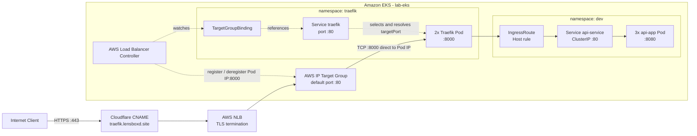
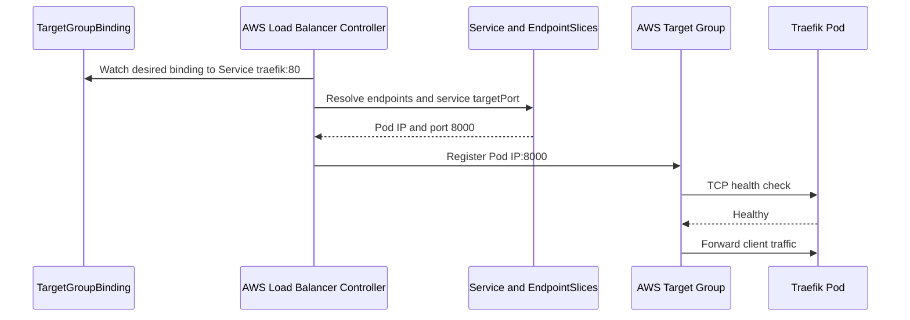

# Kubernetes Platform

Folder ini berisi manifest Kubernetes untuk platform dan aplikasi yang berjalan
di cluster EKS `lab-eks`. Kustomize digunakan untuk menyusun base dan overlay,
sedangkan Helm digunakan untuk memasang AWS Load Balancer Controller.

Infrastruktur AWS yang menjadi dependensi folder ini dijelaskan pada
[`../provision/README.md`](../provision/README.md).

## Arsitektur Request



NLB melakukan terminasi TLS. Setelah itu traffic diteruskan sebagai TCP langsung
ke IP Pod Traefik pada port `8000`, tanpa melewati ClusterIP Service. Service
`traefik` digunakan controller untuk menemukan endpoint dan target port. Traefik
membaca `IngressRoute` dan meneruskan request ke aplikasi melalui Kubernetes
Service.

## Alur Integrasi AWS



AWS Load Balancer Controller menggunakan EKS Pod Identity. IAM role dan
association-nya dibuat oleh OpenTofu, bukan oleh script Helm.

## Struktur Folder

```text
k8s/
|-- namespace/
|   |-- dev.yaml
|   |-- prod.yaml
|   `-- traefik.yaml
|-- platform/
|   |-- aws-load-balancer-controller/
|   |   `-- install.sh
|   `-- traefik/
|       |-- base/
|       `-- overlays/lab/
|-- apps/
|   |-- base/
|   `-- overlays/dev/
`-- README.md
```

## Namespace

| Namespace | Fungsi | Status penggunaan |
|---|---|---|
| `kube-system` | AWS Load Balancer Controller dan add-on cluster | Aktif |
| `traefik` | Traefik dan `TargetGroupBinding` | Aktif |
| `dev` | Workload aplikasi development | Aktif |
| `prod` | Ruang workload production | Disiapkan, belum memiliki overlay aplikasi |

Manifest namespace tidak dimasukkan ke Kustomization. Apply folder `namespace`
secara terpisah sebelum platform dan aplikasi.

## AWS Load Balancer Controller

Installer berada di:

```text
platform/aws-load-balancer-controller/install.sh
```

Script menambahkan repo Helm EKS, memperbarui index chart, lalu menjalankan
`helm upgrade --install`. Default yang digunakan:

| Parameter | Default |
|---|---|
| Release | `aws-load-balancer-controller` |
| Chart | `eks/aws-load-balancer-controller` |
| Namespace | `kube-system` |
| Cluster | `lab-eks` |
| Region | `eu-north-1` |
| VPC | `vpc-063342a708c4fed04` |

Nilai dapat dioverride menggunakan environment variable:

```bash
CLUSTER_NAME=lab-eks \
AWS_REGION=eu-north-1 \
VPC_ID=vpc-063342a708c4fed04 \
./aws_kube/k8s/platform/aws-load-balancer-controller/install.sh
```

Untuk environment saat ini, jangan override `NAMESPACE` atau `RELEASE_NAME`.
Pod Identity association terikat pada namespace `kube-system` dan ServiceAccount
`aws-load-balancer-controller`; perintah rollout dan uninstall pada dokumen ini
juga menggunakan nilai tersebut. Jika keduanya diubah, perbarui association
OpenTofu dan seluruh perintah operasional secara bersamaan.

## Traefik

Base Traefik berisi ServiceAccount, RBAC, Deployment, dan ClusterIP Service.

| Komponen | Konfigurasi |
|---|---|
| Image | `traefik:v3.3` |
| Replica | 2 |
| Provider | Kubernetes CRD |
| Watched namespaces | `dev`, `prod` |
| EntryPoint | `api` pada TCP port `8000` |
| Service | `traefik:80` ke named target port `api` (`8000`) |
| Health endpoint | `/ping` |
| Dashboard | Nonaktif |
| Security | Non-root, seccomp runtime default, read-only root FS, drop all capabilities |
| Resources | Request `50m/64Mi`, limit `200m/128Mi` |

Overlay `platform/traefik/overlays/lab` menambahkan
`TargetGroupBinding/traefik`. Binding menunjuk ke Service `traefik:80` dengan
target type `ip`, sehingga IP Pod Traefik didaftarkan langsung ke Target Group.

ARN Target Group masih hard-coded dan harus disamakan dengan output OpenTofu:

```bash
cd aws_kube/provision
tofu output -raw traefik_target_group_arn
```

## Aplikasi Development

Base aplikasi mendefinisikan Deployment, ClusterIP Service, dan Traefik
`IngressRoute`. Overlay `apps/overlays/dev` menempatkan resource ke namespace
`dev` dan menaikkan replica menjadi tiga.

| Komponen | Konfigurasi |
|---|---|
| Deployment | `api-app` |
| Image | `unedotamps/api-app:latest` |
| Replica dev | 3 |
| Container port | `8080` |
| Service | `api-service:80` ke `8080` |
| Liveness probe | `GET /healthz` pada port `8080` |
| Route | ``Host(`traefik.lensboxd.site`)`` |
| EntryPoint | `api` |

Source image contoh berada di [`../apps/go-healthcheck`](../apps/go-healthcheck).
Aplikasi menyediakan endpoint `/`, `/healthz`, dan `/readyz` serta memakai nama
Pod sebagai nilai `APP_NAME`.

Tag image `latest` bersifat mutable. Untuk deployment yang repeatable, build dan
push image dengan tag immutable, lalu perbarui manifest atau overlay Kustomize.

## Prasyarat

- Infrastruktur pada `aws_kube/provision` sudah selesai di-apply.
- `kubectl` sudah terhubung ke cluster `lab-eks`.
- Helm 3 tersedia.
- AWS CLI profile memiliki akses untuk membaca EKS dan Target Group.
- Traefik CRD, termasuk `IngressRoute`, tersedia pada cluster.

Repository ini belum menyimpan manifest Traefik CRD secara lokal. Install CRD
resmi yang dipin ke versi `v3.3` sebelum menerapkan aplikasi. RBAC Traefik sudah
tersedia pada `platform/traefik/base/rbac.yaml`.

```bash
kubectl apply -f \
  https://raw.githubusercontent.com/traefik/traefik/v3.3/docs/content/reference/dynamic-configuration/kubernetes-crd-definition-v1.yml

kubectl get crd ingressroutes.traefik.io
```

AWS Load Balancer Controller Helm chart menyediakan CRD
`targetgroupbindings.elbv2.k8s.aws` yang dibutuhkan overlay Traefik.

## Urutan Deployment

Semua perintah berikut dijalankan dari root repository.

### 1. Hubungkan `kubectl`

```bash
AWS_PROFILE=dev aws eks update-kubeconfig \
  --region eu-north-1 \
  --name lab-eks

kubectl cluster-info
kubectl get nodes
```

### 2. Buat Namespace

```bash
kubectl apply -f aws_kube/k8s/namespace/
```

### 3. Install Traefik CRD

```bash
kubectl apply -f \
  https://raw.githubusercontent.com/traefik/traefik/v3.3/docs/content/reference/dynamic-configuration/kubernetes-crd-definition-v1.yml

kubectl get crd ingressroutes.traefik.io
```

### 4. Install AWS Load Balancer Controller

```bash
./aws_kube/k8s/platform/aws-load-balancer-controller/install.sh

kubectl -n kube-system rollout status \
  deployment/aws-load-balancer-controller
```

Pastikan CRD tersedia:

```bash
kubectl get crd targetgroupbindings.elbv2.k8s.aws
```

### 5. Deploy Traefik

```bash
kubectl apply -k aws_kube/k8s/platform/traefik/overlays/lab

kubectl -n traefik rollout status deployment/traefik
kubectl -n traefik get service,pod,targetgroupbinding
```

Gunakan overlay `lab`, bukan `base`, agar `TargetGroupBinding` ikut dibuat.

### 6. Deploy Aplikasi Dev

Pastikan Traefik CRD sudah tersedia, lalu jalankan:

```bash
kubectl apply -k aws_kube/k8s/apps/overlays/dev

kubectl -n dev rollout status deployment/api-app
kubectl -n dev get deployment,service,pod,ingressroute
```

Gunakan overlay `dev`, bukan apply langsung ke `apps/base`, agar seluruh resource
mendapat namespace dan jumlah replica yang benar.

## Verifikasi End-to-End

### Status Kubernetes

```bash
kubectl -n kube-system get pod \
  -l app.kubernetes.io/name=aws-load-balancer-controller

kubectl -n traefik get pod,service,targetgroupbinding
kubectl -n dev get pod,service,ingressroute
```

### Status Target Group

```bash
TARGET_GROUP_ARN="$(tofu -chdir=aws_kube/provision \
  output -raw traefik_target_group_arn)"

AWS_PROFILE=dev aws elbv2 describe-target-health \
  --region eu-north-1 \
  --target-group-arn "${TARGET_GROUP_ARN}"
```

Target yang sehat adalah IP Pod Traefik pada port `8000` dengan state `healthy`.

### DNS dan Endpoint

```bash
dig +short traefik.lensboxd.site
curl --fail --show-error --verbose https://traefik.lensboxd.site/
```

Jika request gagal, periksa secara berurutan:

1. DNS mengarah ke hostname NLB.
2. ACM certificate pada listener port `443` berstatus valid.
3. AWS Load Balancer Controller dan Traefik Pod berstatus `Running`.
4. `TargetGroupBinding` tidak memiliki error reconciliation.
5. Target Group menampilkan Pod IP port `8000` sebagai `healthy`.
6. Host pada request sama dengan rule `traefik.lensboxd.site`.
7. Pod `api-app` dan Service `api-service` memiliki endpoint.

## Update dan Rollback

Render manifest sebelum apply untuk memeriksa hasil overlay:

```bash
kubectl kustomize aws_kube/k8s/platform/traefik/overlays/lab
kubectl kustomize aws_kube/k8s/apps/overlays/dev
```

Pantau perubahan Deployment:

```bash
kubectl -n traefik rollout status deployment/traefik
kubectl -n dev rollout status deployment/api-app
```

Rollback Deployment menggunakan revision Kubernetes yang tersedia:

```bash
kubectl -n dev rollout history deployment/api-app
kubectl -n dev rollout undo deployment/api-app
```

## Menghapus Workload

Hapus aplikasi sebelum platform:

```bash
kubectl delete -k aws_kube/k8s/apps/overlays/dev
kubectl delete -k aws_kube/k8s/platform/traefik/overlays/lab
helm uninstall aws-load-balancer-controller --namespace kube-system
kubectl delete -f aws_kube/k8s/namespace/
```

Pastikan target Pod sudah tidak terdaftar sebelum menghancurkan NLB atau EKS.

## Batasan Saat Ini

- Traefik CRD belum disimpan secara lokal dan masih diambil dari URL resmi saat
  deployment.
- ARN Target Group pada `TargetGroupBinding` masih hard-coded.
- VPC ID pada installer AWS Load Balancer Controller masih hard-coded.
- Helm chart controller belum dipin ke versi tertentu.
- Image aplikasi memakai tag mutable `latest`.
- Aplikasi belum memiliki readiness probe, resource request/limit, PDB, atau HPA.
- Namespace `prod` belum memiliki workload overlay.
- Domain pada `IngressRoute` masih spesifik untuk environment lab.
