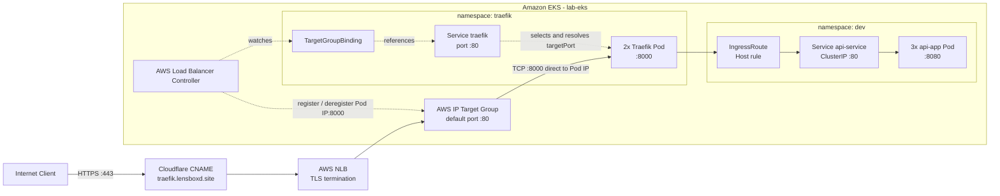
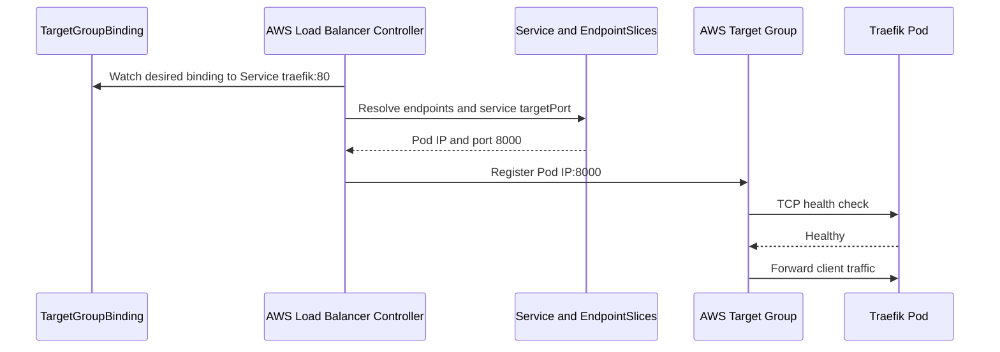
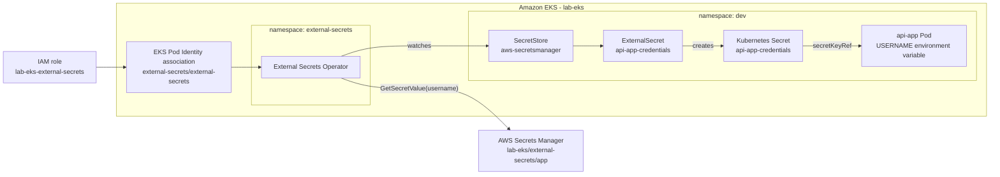
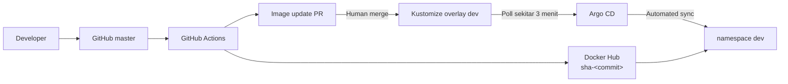

# Kubernetes Platform

Folder ini berisi manifest Kubernetes untuk platform dan aplikasi yang berjalan
di cluster EKS `lab-eks`. Kustomize digunakan untuk menyusun base dan overlay,
sedangkan Helm digunakan untuk memasang controller platform seperti AWS Load
Balancer Controller, External Secrets Operator, dan Argo CD.

Infrastruktur AWS yang menjadi dependensi folder ini dijelaskan pada
[`../provision/README.md`](../provision/README.md).

## Arsitektur Request



NLB melakukan terminasi TLS. Setelah itu traffic diteruskan sebagai TCP langsung
ke IP Pod Traefik pada port `8000`, tanpa melewati ClusterIP Service. Service
`traefik` digunakan controller untuk menemukan endpoint dan target port. Traefik
membaca `IngressRoute` dan meneruskan request ke aplikasi melalui Kubernetes
Service.

## Alur Integrasi AWS



AWS Load Balancer Controller menggunakan EKS Pod Identity. IAM role dan
association-nya dibuat oleh OpenTofu, bukan oleh script Helm.

## Struktur Folder

```text
k8s/
|-- namespace/
|   |-- dev.yaml
|   |-- prod.yaml
|   `-- traefik.yaml
|-- platform/
|   |-- argocd/
|   |   |-- applications/
|   |   |   `-- api-dev.yaml
|   |   `-- install.sh
|   |-- aws-load-balancer-controller/
|   |   `-- install.sh
|   |-- external-secrets/
|   |   `-- install.sh
|   `-- traefik/
|       |-- install-crds.sh
|       |-- base/
|       `-- overlays/lab/
|-- apps/
|   |-- base/
|   `-- overlays/dev/
`-- README.md
```

## Namespace

| Namespace | Fungsi | Status penggunaan |
|---|---|---|
| `argocd` | Argo CD control plane dan resource `Application` | Aktif |
| `external-secrets` | External Secrets Operator, webhook, dan certificate controller | Aktif |
| `kube-system` | AWS Load Balancer Controller dan add-on cluster | Aktif |
| `traefik` | Traefik dan `TargetGroupBinding` | Aktif |
| `dev` | Workload aplikasi development | Aktif |
| `prod` | Ruang workload production | Disiapkan, belum memiliki overlay aplikasi |

Manifest namespace tidak dimasukkan ke Kustomization. Apply folder `namespace`
secara terpisah sebelum platform dan aplikasi.

## AWS Load Balancer Controller

Installer berada di:

```text
platform/aws-load-balancer-controller/install.sh
```

Script menambahkan repo Helm EKS, memperbarui index chart, lalu menjalankan
`helm upgrade --install`. Default yang digunakan:

| Parameter | Default |
|---|---|
| Release | `aws-load-balancer-controller` |
| Chart | `eks/aws-load-balancer-controller` |
| Namespace | `kube-system` |
| Cluster | `lab-eks` |
| Region | `eu-north-1` |
| VPC | `vpc-063342a708c4fed04` |

Nilai dapat dioverride menggunakan environment variable:

```bash
CLUSTER_NAME=lab-eks \
AWS_REGION=eu-north-1 \
VPC_ID=vpc-063342a708c4fed04 \
./aws_kube/k8s/platform/aws-load-balancer-controller/install.sh
```

Untuk environment saat ini, jangan override `NAMESPACE` atau `RELEASE_NAME`.
Pod Identity association terikat pada namespace `kube-system` dan ServiceAccount
`aws-load-balancer-controller`; perintah rollout dan uninstall pada dokumen ini
juga menggunakan nilai tersebut. Jika keduanya diubah, perbarui association
OpenTofu dan seluruh perintah operasional secara bersamaan.

## External Secrets Operator

External Secrets Operator (ESO) mengambil value dari AWS Secrets Manager dan
membuat Kubernetes Secret berdasarkan resource `ExternalSecret`. Controller ESO
berjalan pada namespace `external-secrets` dengan ServiceAccount
`external-secrets`. AWS access tidak memakai access key di Kubernetes; ESO
mendapatkan temporary credentials melalui EKS Pod Identity.

### Alur Secret



OpenTofu membuat IAM role dan association. Helm membuat CRD, controller, dan
ServiceAccount. `SecretStore` serta `ExternalSecret` dikelola oleh Kustomize
bersama workload aplikasi. Karena `SecretStore` bersifat namespaced, keduanya
berada pada namespace yang sama setelah overlay diterapkan. Base tidak
mendefinisikan `metadata.namespace`; overlay `dev` menetapkannya menjadi `dev`.

### Instalasi ESO

Installer berada di:

```text
platform/external-secrets/install.sh
```

Jalankan setelah OpenTofu membuat Pod Identity association:

```bash
./aws_kube/k8s/platform/external-secrets/install.sh
```

Script memasang Helm chart resmi External Secrets Operator dengan CRD,
controller, webhook, certificate controller, dan ServiceAccount
`external-secrets` pada namespace `external-secrets`.

Untuk menggunakan versi chart tertentu:

```bash
helm search repo external-secrets/external-secrets --versions

ESO_CHART_VERSION=<tested-version> \
  ./aws_kube/k8s/platform/external-secrets/install.sh
```

Verifikasi:

```bash
kubectl get crd \
  externalsecrets.external-secrets.io \
  secretstores.external-secrets.io

kubectl -n external-secrets get serviceaccount external-secrets
kubectl -n external-secrets rollout status deployment/external-secrets
kubectl -n external-secrets get pods
```

### SecretStore dan ExternalSecret

Manifest berada di `apps/base/secret.yaml` dan ikut dirender oleh overlay
`apps/overlays/dev`. Provider AWS tidak memiliki blok `auth` karena controller
menggunakan EKS Pod Identity.

Secret AWS yang digunakan untuk testing adalah:

```text
lab-eks/external-secrets/app
```

Value secret diisi di luar Terraform dan Git:

```bash
AWS_PROFILE=dev aws secretsmanager put-secret-value \
  --secret-id lab-eks/external-secrets/app \
  --secret-string '{"username":"test-user"}' \
  --region eu-north-1
```

`ExternalSecret` mengambil property `username` dan membuat Secret
`api-app-credentials` pada namespace `dev`. Deployment `api-app` membaca key
tersebut sebagai environment variable `USERNAME`. Endpoint `/` menampilkan
username hanya untuk testing development dan tidak boleh dipakai untuk
mengekspos secret pada production.

Verifikasi sinkronisasi:

```bash
kubectl -n dev get secretstore aws-secretsmanager
kubectl -n dev get externalsecret api-app-credentials
kubectl -n dev get secret api-app-credentials
kubectl -n dev describe externalsecret api-app-credentials
```

## Argo CD

Argo CD menjalankan continuous delivery dengan model pull-based. CI membangun
image dan membuat Pull Request perubahan tag image. Setelah Pull Request
di-merge, Argo CD membaca state terbaru dari Git, membandingkannya dengan state
cluster, lalu melakukan sinkronisasi otomatis.



Argo CD tidak membangun image dan CI tidak menjalankan `kubectl apply`. Git
menjadi desired state, sedangkan Argo CD menjadi controller yang menerapkan
desired state tersebut ke EKS.

### Instalasi Argo CD

Installer berada di:

```text
platform/argocd/install.sh
```

Jalankan dari root repository:

```bash
./aws_kube/k8s/platform/argocd/install.sh
```

Helm chart memasang controller Argo CD sekaligus CRD cluster-scoped seperti
`applications.argoproj.io`. Kondisi release lab saat dokumentasi ini ditulis:

| Item | Nilai |
|---|---|
| Helm release | `argocd` |
| Namespace | `argocd` |
| Chart | `argo-cd-10.9.2` |
| Argo CD | `v3.5.3` |

Verifikasi instalasi:

```bash
helm list --namespace argocd
kubectl get pods --namespace argocd
kubectl get crd applications.argoproj.io
```

Script saat ini belum memin versi chart. Periksa hasil `helm upgrade` sebelum
upgrade berikutnya karena versi terbaru repository Helm dapat berubah.

### Application `api-dev`

Manifest GitOps aplikasi development berada di:

```text
platform/argocd/applications/api-dev.yaml
```

Konfigurasi utamanya:

| Field | Nilai | Fungsi |
|---|---|---|
| `metadata.namespace` | `argocd` | Lokasi resource `Application` |
| `spec.source.repoURL` | `https://github.com/unedtamps/aws.git` | Repository desired state |
| `spec.source.targetRevision` | `HEAD` | Default branch repository |
| `spec.source.path` | `aws_kube/k8s/apps/overlays/dev` | Overlay Kustomize yang dirender |
| `spec.destination.server` | `https://kubernetes.default.svc` | Cluster yang sama dengan Argo CD |
| `spec.destination.namespace` | `dev` | Namespace target workload |

Apply resource setelah Argo CD dan Traefik CRD siap:

```bash
kubectl apply -f \
  aws_kube/k8s/platform/argocd/applications/api-dev.yaml
```

Argo CD mendeteksi `kustomization.yaml` pada source path dan merender overlay
secara otomatis. Gunakan `targetRevision: master` jika branch ingin dinyatakan
secara eksplisit, bukan mengikuti default branch melalui `HEAD`.

### Sync Policy

`api-dev` menggunakan automated sync:

```yaml
syncPolicy:
  automated:
    selfHeal: true
    prune: true
  syncOptions:
    - CreateNamespace=true
```

| Opsi | Perilaku |
|---|---|
| `automated` | Menjalankan sync saat desired state berubah |
| `selfHeal: true` | Mengembalikan perubahan manual cluster agar sesuai Git |
| `prune: true` | Menghapus resource yang sudah dihapus dari Git |
| `CreateNamespace=true` | Membuat namespace target jika belum tersedia |
| `retry` | Mengulang sync yang gagal sementara dengan exponential backoff |

Argo CD melakukan polling repository setiap sekitar tiga menit secara default,
yaitu 120 detik ditambah jitter hingga 60 detik. GitHub webhook dapat ditambahkan
untuk refresh lebih cepat, tetapi polling tetap menjadi mekanisme fallback yang
sederhana dan tidak membutuhkan endpoint Argo CD publik.

### Repository Access

Repository public dapat dibaca langsung dari `repoURL` tanpa credential. Untuk
repository private, gunakan GitHub fine-grained token read-only, SSH deploy key,
atau GitHub App. Credential disimpan sebagai Secret di namespace `argocd`, bukan
sebagai Kubernetes ServiceAccount.

Contoh Secret untuk repository private:

```yaml
apiVersion: v1
kind: Secret
metadata:
  name: github-repository
  namespace: argocd
  labels:
    argocd.argoproj.io/secret-type: repository
type: Opaque
stringData:
  type: git
  url: https://github.com/OWNER/REPOSITORY.git
  username: OWNER
  password: <github-fine-grained-token>
```

Jangan commit Secret yang berisi token. Buat melalui secret manager, External
Secrets, Argo CD UI, atau perintah `argocd repo add`. Nilai `url` harus sama
dengan `spec.source.repoURL` pada `Application`.

### Akses Argo CD

Gunakan port-forward agar server tidak perlu dibuka ke internet:

```bash
kubectl port-forward \
  --namespace argocd \
  service/argocd-server 8080:443
```

Buka `https://localhost:8080`. Username awal adalah `admin`. Ambil password awal
dengan:

```bash
argocd admin initial-password --namespace argocd
```

Tanpa Argo CD CLI, baca Secret bootstrap secara langsung:

```bash
kubectl get secret argocd-initial-admin-secret \
  --namespace argocd \
  --output jsonpath='{.data.password}' | base64 --decode
```

Ganti password admin setelah login, lalu hapus
`argocd-initial-admin-secret` karena Secret tersebut hanya menyimpan password
bootstrap.

```bash
kubectl delete secret argocd-initial-admin-secret --namespace argocd
```

## Traefik

Base Traefik berisi ServiceAccount, RBAC, Deployment, dan ClusterIP Service.
CRD Traefik dipasang terpisah menggunakan `platform/traefik/install-crds.sh`.
Script memasang chart khusus `traefik-crds` versi `1.18.0` sebagai release
`traefik-crds` pada namespace `traefik`.

Release tersebut hanya mengelola CRD Traefik. Gateway API, Knative, dan Traefik
Hub CRD dinonaktifkan. Deployment, Service, ServiceAccount, dan RBAC Traefik
tetap dikelola oleh Kustomize.

| Komponen | Konfigurasi |
|---|---|
| Image | `traefik:v3.3` |
| Replica | 2 |
| Provider | Kubernetes CRD |
| Watched namespaces | `dev`, `prod` |
| EntryPoint | `api` pada TCP port `8000` |
| Service | `traefik:80` ke named target port `api` (`8000`) |
| Health endpoint | `/ping` |
| Dashboard | Nonaktif |
| Security | Non-root, seccomp runtime default, read-only root FS, drop all capabilities |
| Resources | Request `50m/64Mi`, limit `200m/128Mi` |

Overlay `platform/traefik/overlays/lab` menambahkan
`TargetGroupBinding/traefik`. Binding menunjuk ke Service `traefik:80` dengan
target type `ip`, sehingga IP Pod Traefik didaftarkan langsung ke Target Group.

ARN Target Group masih hard-coded dan harus disamakan dengan output OpenTofu:

```bash
cd aws_kube/provision
tofu output -raw traefik_target_group_arn
```

## Aplikasi Development

Base aplikasi mendefinisikan Deployment, ClusterIP Service, dan Traefik
`IngressRoute`. Overlay `apps/overlays/dev` menempatkan resource ke namespace
`dev` dan menaikkan replica menjadi tiga.

| Komponen | Konfigurasi |
|---|---|
| Deployment | `api-app` |
| Image | `unedotamps/api-app:<dev-newTag>` |
| Replica dev | 3 |
| Container port | `8080` |
| Service | `api-service:80` ke `8080` |
| Liveness probe | `GET /healthz` pada port `8080` |
| Rolling update | `maxSurge: 0`, `maxUnavailable: 1` |
| Route | ``Host(`traefik.lensboxd.site`)`` |
| EntryPoint | `api` |

Source image contoh berada di [`../apps/api`](../apps/api).
Aplikasi menyediakan endpoint `/`, `/hello`, `/healthz`, dan `/readyz` serta
memakai nama Pod sebagai nilai `APP_NAME`.

Base masih memakai `latest` sebagai placeholder, sedangkan CI memperbarui
`newTag` overlay `dev` ke tag immutable `sha-<commit>` melalui Pull Request.

## Prasyarat

- Infrastruktur pada `aws_kube/provision` sudah selesai di-apply.
- `kubectl` sudah terhubung ke cluster `lab-eks`.
- Helm 3 tersedia.
- Argo CD CLI bersifat opsional untuk login dan pengelolaan repository.
- AWS CLI profile memiliki akses untuk membaca EKS dan Target Group.
- Traefik CRD, termasuk `IngressRoute`, tersedia pada cluster.

Repository ini tidak menyimpan manifest Traefik CRD secara lokal. Install CRD
dari Helm chart yang versinya sudah dipin sebelum menerapkan aplikasi. RBAC
Traefik tersedia pada `platform/traefik/base/rbac.yaml`.

```bash
./aws_kube/k8s/platform/traefik/install-crds.sh

kubectl get crd ingressroutes.traefik.io
```

Versi chart dapat dioverride bila CRD perlu diperbarui:

```bash
TRAEFIK_CHART_VERSION=1.18.0 \
  ./aws_kube/k8s/platform/traefik/install-crds.sh
```

Jika CRD sudah dibuat oleh release Helm lain, lakukan adopsi secara eksplisit
setelah memeriksa versi CRD yang aktif:

```bash
TAKE_OWNERSHIP=true \
  ./aws_kube/k8s/platform/traefik/install-crds.sh
```

Tanpa `TAKE_OWNERSHIP=true`, script tidak mengambil alih ownership resource yang
sudah dimiliki release lain.

AWS Load Balancer Controller Helm chart menyediakan CRD
`targetgroupbindings.elbv2.k8s.aws` yang dibutuhkan overlay Traefik.

## Urutan Deployment

Semua perintah berikut dijalankan dari root repository.

### 1. Hubungkan `kubectl`

```bash
AWS_PROFILE=dev aws eks update-kubeconfig \
  --region eu-north-1 \
  --name lab-eks

kubectl cluster-info
kubectl get nodes
```

### 2. Buat Namespace

```bash
kubectl apply -f aws_kube/k8s/namespace/
```

### 3. Install Traefik CRD

```bash
./aws_kube/k8s/platform/traefik/install-crds.sh

kubectl get crd ingressroutes.traefik.io
```

### 4. Install AWS Load Balancer Controller

```bash
./aws_kube/k8s/platform/aws-load-balancer-controller/install.sh

kubectl -n kube-system rollout status \
  deployment/aws-load-balancer-controller
```

Pastikan CRD tersedia:

```bash
kubectl get crd targetgroupbindings.elbv2.k8s.aws
```

### 5. Deploy Traefik

```bash
kubectl apply -k aws_kube/k8s/platform/traefik/overlays/lab

kubectl -n traefik rollout status deployment/traefik
kubectl -n traefik get service,pod,targetgroupbinding
```

Gunakan overlay `lab`, bukan `base`, agar `TargetGroupBinding` ikut dibuat.

### 6. Install External Secrets Operator

Pod Identity association harus sudah tersedia sebelum controller dijalankan:

```bash
./aws_kube/k8s/platform/external-secrets/install.sh

kubectl get crd \
  externalsecrets.external-secrets.io \
  secretstores.external-secrets.io
kubectl -n external-secrets get pods
```

### 7. Install Argo CD

```bash
./aws_kube/k8s/platform/argocd/install.sh

kubectl get pods --namespace argocd
kubectl get crd applications.argoproj.io
```

### 8. Daftarkan Aplikasi Dev

Pastikan Traefik CRD, External Secrets Operator, dan Argo CD sudah tersedia,
lalu jalankan:

```bash
kubectl apply -f \
  aws_kube/k8s/platform/argocd/applications/api-dev.yaml

kubectl get applications.argoproj.io --namespace argocd --output wide
```

Argo CD selanjutnya merender dan menerapkan overlay `dev`. Jangan melakukan
`kubectl apply -k` pada overlay yang sama setelah dikelola Argo CD, karena
`selfHeal` akan mengembalikan cluster ke desired state Git.

## Verifikasi End-to-End

### Status Argo CD

```bash
kubectl get applications.argoproj.io \
  --namespace argocd \
  --output wide

kubectl describe application api-dev --namespace argocd
```

Sync status dan health status mengukur hal yang berbeda:

| Status | Arti |
|---|---|
| `Synced` | Live state sama dengan desired state pada revision Git |
| `OutOfSync` | Git dan cluster berbeda; auto-sync belum atau sedang berjalan |
| `Unknown` | Argo CD tidak dapat membandingkan state, biasanya karena repo, branch, path, credential, atau render error |
| `Healthy` | Semua resource live dinilai sehat |
| `Progressing` | Rollout belum selesai atau masih menunggu resource siap |
| `Degraded` | Salah satu resource gagal atau tidak sehat |

Jika sync status `Unknown`, lihat `status.conditions` dan log repo server:

```bash
kubectl get application api-dev \
  --namespace argocd \
  --output yaml

kubectl logs \
  --namespace argocd \
  deployment/argocd-repo-server \
  --since=15m
```

Periksa `repoURL`, `targetRevision`, source `path`, dan credential repository.
Source path selalu relatif terhadap root repository Git.

Jika health status `Progressing`, periksa rollout dan event workload:

```bash
kubectl get deployment,pod --namespace dev --output wide
kubectl describe deployment api-app --namespace dev
kubectl get events --namespace dev --sort-by=.lastTimestamp
```

Pod `Pending` dengan pesan `Too many pods` berarti kapasitas Pod node sudah
tercapai, bukan masalah sinkronisasi Argo CD. Pod `ImagePullBackOff` biasanya
menunjukkan tag image tidak tersedia atau registry membutuhkan credential.

Minta Argo CD membaca ulang repository tanpa menunggu polling berikutnya:

```bash
kubectl annotate application api-dev \
  --namespace argocd \
  argocd.argoproj.io/refresh=hard \
  --overwrite
```

### Status Kubernetes

```bash
kubectl -n kube-system get pod \
  -l app.kubernetes.io/name=aws-load-balancer-controller

kubectl -n traefik get pod,service,targetgroupbinding
kubectl -n dev get pod,service,ingressroute
```

### Status Target Group

```bash
TARGET_GROUP_ARN="$(tofu -chdir=aws_kube/provision \
  output -raw traefik_target_group_arn)"

AWS_PROFILE=dev aws elbv2 describe-target-health \
  --region eu-north-1 \
  --target-group-arn "${TARGET_GROUP_ARN}"
```

Target yang sehat adalah IP Pod Traefik pada port `8000` dengan state `healthy`.

### DNS dan Endpoint

```bash
dig +short traefik.lensboxd.site
curl --fail --show-error --verbose https://traefik.lensboxd.site/
```

Jika request gagal, periksa secara berurutan:

1. DNS mengarah ke hostname NLB.
2. ACM certificate pada listener port `443` berstatus valid.
3. AWS Load Balancer Controller dan Traefik Pod berstatus `Running`.
4. `TargetGroupBinding` tidak memiliki error reconciliation.
5. Target Group menampilkan Pod IP port `8000` sebagai `healthy`.
6. Host pada request sama dengan rule `traefik.lensboxd.site`.
7. Pod `api-app` dan Service `api-service` memiliki endpoint.

## Update dan Rollback

Render manifest sebelum merge untuk memeriksa hasil overlay:

```bash
kubectl kustomize aws_kube/k8s/platform/traefik/overlays/lab
kubectl kustomize aws_kube/k8s/apps/overlays/dev
```

Pantau perubahan Deployment:

```bash
kubectl -n traefik rollout status deployment/traefik
kubectl -n dev rollout status deployment/api-app
```

Rollback aplikasi yang dikelola Argo CD dilakukan melalui Git. Revert commit
manifest atau image tag, lalu merge melalui alur review normal:

```bash
git log --oneline -- aws_kube/k8s/apps/overlays/dev/kustomization.yaml
git revert <commit-sha>
```

Jangan mengandalkan `kubectl rollout undo` sebagai rollback permanen. Dengan
`selfHeal: true`, Argo CD akan mengembalikan Deployment ke revision yang masih
tercatat sebagai desired state di Git.

## Menghapus Workload

Hapus aplikasi sebelum platform:

```bash
kubectl delete -f \
  aws_kube/k8s/platform/argocd/applications/api-dev.yaml
kubectl delete -k aws_kube/k8s/apps/overlays/dev
kubectl delete -k aws_kube/k8s/platform/traefik/overlays/lab
helm uninstall traefik-crds --namespace traefik
helm uninstall aws-load-balancer-controller --namespace kube-system
helm uninstall argocd --namespace argocd
kubectl delete namespace argocd
kubectl delete -f aws_kube/k8s/namespace/
```

Hapus `Application` lebih dahulu agar Argo CD tidak membuat workload kembali.
Chart Traefik memakai `deleteOnUninstall=false`, sehingga uninstall release tidak
menghapus CRD dan custom resource secara tidak sengaja. Pastikan target Pod sudah
tidak terdaftar sebelum menghancurkan NLB atau EKS.

## Batasan Saat Ini

- Traefik CRD tidak disimpan secara lokal dan release `traefik-crds` memerlukan
  akses ke Helm repository saat instalasi atau upgrade.
- ARN Target Group pada `TargetGroupBinding` masih hard-coded.
- VPC ID pada installer AWS Load Balancer Controller masih hard-coded.
- Installer AWS Load Balancer Controller dan Argo CD belum memin versi chart.
- Base aplikasi memakai `latest` sebagai placeholder; overlay environment harus
  selalu menggantinya dengan tag immutable.
- Aplikasi belum memiliki readiness probe, resource request/limit, PDB, atau HPA.
- Namespace `prod` belum memiliki workload overlay.
- Domain pada `IngressRoute` masih spesifik untuk environment lab.
- `AppProject/default` masih mengizinkan seluruh source repository, namespace,
  dan cluster resource; buat project yang lebih sempit sebelum production.
