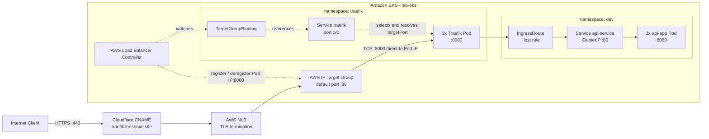
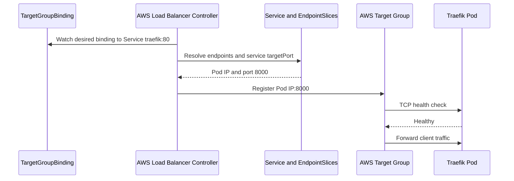
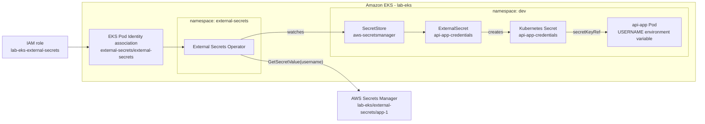
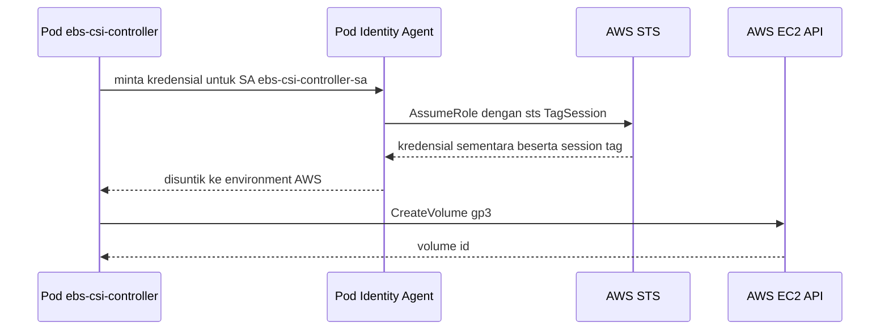
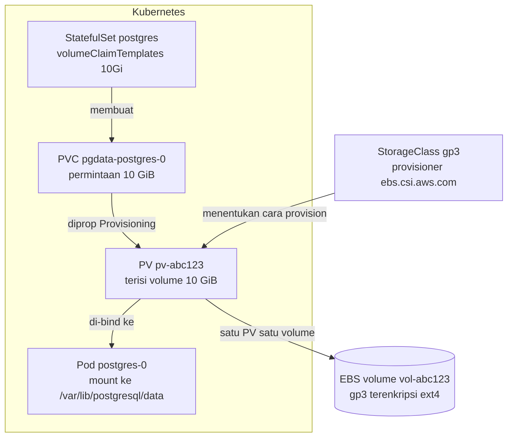
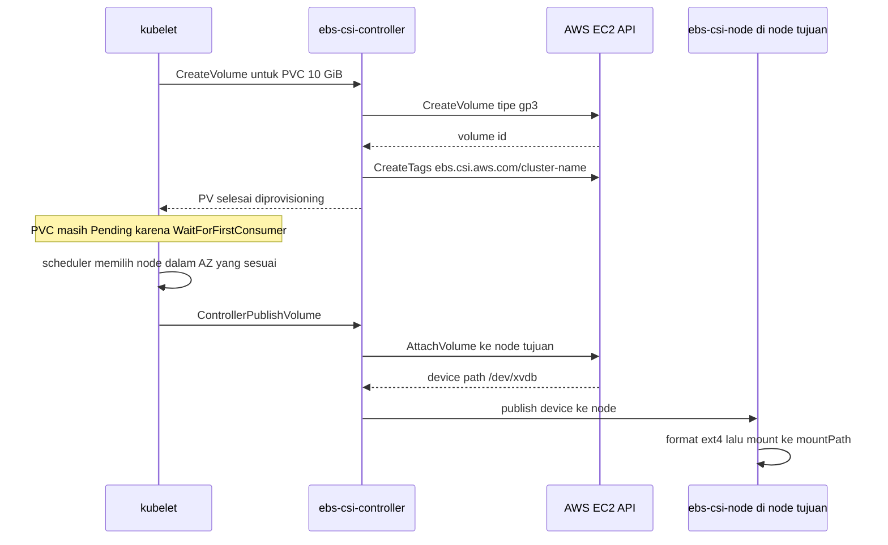
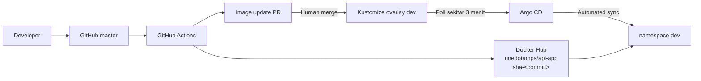

# Kubernetes Platform

Folder ini berisi manifest Kubernetes untuk platform dan aplikasi yang berjalan
di cluster EKS `lab-eks`. Platform di-deploy dengan dua Helm chart; aplikasi
dibangun dengan Kustomize dan diterapkan oleh Argo CD.

Infrastruktur AWS yang menjadi dependensi folder ini dijelaskan pada
[`../provision/README.md`](../provision/README.md).

## Ringkasan Arsitektur

```text
k8s/
|-- platform/
|   |-- core/     Helm chart: controller platform (LBC, ESO, Argo CD, Traefik)
|   `-- apps/     Helm chart: Argo CD Application + TargetGroupBinding
`-- apps/         Kustomize: manifest aplikasi (base + overlays/dev)
```

Dua chart terpisah, bukan satu. Alasannya ada di bagian
[Kenapa Dua Chart](#kenapa-dua-chart).

## Arsitektur Request


```mermaid
flowchart LR
    client["Internet Client"] -->|"HTTPS :443"| dns["Cloudflare CNAME<br/>traefik.lensboxd.site"]
    dns --> nlb["AWS NLB<br/>TLS termination"]
    nlb --> tg["AWS IP Target Group<br/>default port :80"]

    subgraph eks["Amazon EKS - lab-eks"]
        lbc["AWS Load Balancer Controller"] -. "register / deregister Pod IP:8000" .-> tg

        subgraph traefikNs["namespace: traefik"]
            tgb["TargetGroupBinding"] -. "references" .-> svcTraefik["Service traefik<br/>port :80"]
            svcTraefik -. "selects and resolves targetPort" .-> podsTraefik["3x Traefik Pod<br/>:8000"]
        end

        subgraph devNs["namespace: dev"]
            route["IngressRoute<br/>Host rule"] --> svcApi["Service api-service<br/>ClusterIP :80"]
            svcApi --> podsApi["3x api-app Pod<br/>:8080"]
        end

        podsTraefik --> route
        lbc -. "watches" .-> tgb
    end

    tg -->|"TCP :8000 direct to Pod IP"| podsTraefik
```

NLB melakukan terminasi TLS. Setelah itu traffic diteruskan sebagai TCP langsung
ke IP Pod Traefik pada port `8000`, tanpa melewati ClusterIP Service. Service
`traefik` digunakan controller untuk menemukan endpoint dan target port. Traefik
membaca `IngressRoute` dan meneruskan request ke aplikasi melalui Kubernetes
Service.

### Peran Service traefik

Service itu bukan dilewati traffic, tapi **wajib ada** sebagai perantara
discovery:

```text
NLB  --mencari--> Service "traefik" port 80  -->  targetPort "api"  -->  podIP:8000
```

Tanpa Service, AWS Load Balancer Controller tidak punya informasi bahwa pod
Traefik berada di port `8000`. `TargetGroupBinding` yang specifying Service
tersebut sebagai sumber endpoint; menghapus Service akan membuat controller
deregister seluruh target.

### Alur Integrasi AWS


```mermaid
sequenceDiagram
    participant TGB as TargetGroupBinding
    participant LBC as AWS Load Balancer Controller
    participant K8s as Service and EndpointSlices
    participant ELB as AWS Target Group
    participant Pod as Traefik Pod

    LBC->>TGB: Watch desired binding to Service traefik:80
    LBC->>K8s: Resolve endpoints and service targetPort
    K8s-->>LBC: Pod IP and port 8000
    LBC->>ELB: Register Pod IP:8000
    ELB->>Pod: TCP health check
    Pod-->>ELB: Healthy
    ELB->>Pod: Forward client traffic
```

AWS Load Balancer Controller menggunakan EKS Pod Identity. IAM role dan
association-nya dibuat oleh OpenTofu, bukan oleh chart Helm.

## Chart Platform

### Chart `platform/core`

Satu umbrella chart yang memasang lima controller sekaligus:

| Subchart | Versi | Repository | Namespace | ServiceAccount |
|---|---|---|---|---|
| `aws-load-balancer-controller` | `3.6.0` | `https://aws.github.io/eks-charts` | `kube-system` | `aws-load-balancer-controller` |
| `external-secrets` | `2.12.0` | `https://charts.external-secrets.io` | `external-secrets` | `external-secrets` |
| `argo-cd` | `10.10.0` | `https://argoproj.github.io/argo-helm` | `argocd` | `argocd` |
| `traefik` | `41.6.1` | `https://traefik.github.io/charts` | `traefik` | `traefik` |
| `aws-ebs-csi-driver` | `2.66.0` | `https://kubernetes-sigs.github.io/aws-ebs-csi-driver` | `kube-system` | `ebs-csi-controller-sa`, `ebs-csi-node-sa` |

Versi dipin di `Chart.yaml`. `Chart.lock` di-commit agar `helm dependency
update` menghasilkan resolusi yang sama di semua mesin.

Release name tetap `platform` di namespace `kube-system`.

```bash
cd aws_kube/k8s/platform/core

make deps       # unduh 5 dependency chart (butuh internet)
make lint       # helm lint
make check      # lint + render, tanpa menyentuh cluster
make install    # helm upgrade --install
make status     # semua workload lintas namespace
make wait       # tunggu sampai semua Deployment/StatefulSet ready
make helm-status
```

`make wait` berguna sebelum `platform/apps` di-install: `TargetGroupBinding`
butuh endpoint webhook AWS Load Balancer Controller sudah ada.

### Chart `platform/apps`

Resource yang bergantung pada chart `core` sudah terpasang:

| Resource | Fungsi |
|---|---|
| `Application/api-dev` | Memberi tahu Argo CD untuk sync `apps/overlays/dev` |
| `TargetGroupBinding/traefik` | Mendaftarkan Pod Traefik ke NLB Target Group |

```bash
cd aws_kube/k8s/platform/apps

make check      # lint + render
make precheck   # verifikasi CRD dan endpoint webhook LBC
make install
make status
```

`precheck` berjalan otomatis sebelum `install`. Kalau `TargetGroupBinding`
dibuat sebelum webhook LBC punya endpoint, install gagal dengan:

```text
no endpoints available for service "aws-load-balancer-webhook-service"
```

### Kenapa Dua Chart

`Application` dan `TargetGroupBinding` **tidak bisa** berada di release yang
sama dengan controller-nya. Dua alasan:

**1. CRD belum tersedia saat validasi.** Chart `argo-cd` dan
`external-secrets` memasang CRD lewat `templates/crds/`, bukan folder `crds/`.
Artinya CRD ikut menjadi manifest biasa dan baru ada setelah install berjalan.
Kalau satu release, Helm gagal sebelum sempat membuat apa pun:

```text
Error: unable to build kubernetes objects from release manifest:
  no matches for kind "Application" in version "argoproj.io/v1alpha1"
```

**2. Webhook LBC belum siap.** `TargetGroupBinding` diproses oleh mutating
webhook milik AWS Load Balancer Controller. Kalau controller masih start,
install gagal:

```text
Error: failed to create resource: ... failed calling webhook
  "mtargetgroupbinding.elbv2.k8s.aws": no endpoints available
```

Chart `traefik` dan `aws-load-balancer-controller` memasang CRD lewat folder
`crds/`, yang Helm proses sebelum render. Itu sebabnya CRD Traefik dan LBC
tidak mengalami masalah yang sama.

### Namespace

Namespace platform dibuat manual, bukan oleh chart:

```bash
kubectl create namespace argocd
kubectl create namespace traefik
kubectl create namespace external-secrets
```

Alasannya chart `argo-cd` punya `pre-install` hook (`redis-secret-init`) yang
butuh namespace `argocd` sudah ada. Hook berjalan sebelum manifest biasa, jadi
namespace tidak bisa dibuat oleh release yang sama.

`helm uninstall platform` **tidak menghapus** namespace tersebut. Hapus manual:

```bash
kubectl delete namespace argocd traefik external-secrets
```

| Namespace | Sumber | Fungsi |
|---|---|---|
| `kube-system` | Cluster | Release `platform`, AWS Load Balancer Controller, EBS CSI driver, Pod Identity Agent |
| `argocd` | Manual | Argo CD control plane dan resource `Application` |
| `traefik` | Manual | Traefik |
| `external-secrets` | Manual | External Secrets Operator |
| `dev` | Argo CD (`CreateNamespace=true`) | Workload aplikasi development |
| `prod` | Belum ada | Ruang workload production |

## AWS Load Balancer Controller

Chart dipasang sebagai subchart di `platform/core`. Pod Identity association
terikat pada namespace `kube-system` dan ServiceAccount
`aws-load-balancer-controller`. **Jangan override keduanya** — jika berubah,
association OpenTofu di `../provision` harus ikut diperbarui, karena
pencocokan dilakukan persis pada nama namespace dan ServiceAccount.

Konfigurasi di `platform/core/values.yaml`:

```yaml
aws-load-balancer-controller:
  clusterName: lab-eks
  region: eu-north-1
  vpcId: vpc-04b8aac84a36b4d0e
  fullnameOverride: aws-load-balancer-controller
```

Chart LBC tidak menyediakan `namespaceOverride`, jadi resource-nya selalu ikut
release namespace (`kube-system`).

## External Secrets Operator

ESO menarik value dari AWS Secrets Manager dan membuat Kubernetes Secret
berdasarkan resource `ExternalSecret`. AWS access tidak memakai access key;
temporary credentials diperoleh melalui EKS Pod Identity.

```yaml
external-secrets:
  namespaceOverride: external-secrets
  fullnameOverride: external-secrets
  installCRDs: true
```

### Alur Secret


```mermaid
flowchart LR
    awsSecret["AWS Secrets Manager<br/>lab-eks/external-secrets/app-1"]
    iam["IAM role<br/>lab-eks-external-secrets"]

    subgraph eks["Amazon EKS - lab-eks"]
        association["EKS Pod Identity association<br/>external-secrets/external-secrets"]

        subgraph esoNs["namespace: external-secrets"]
            eso["External Secrets Operator"]
        end

        subgraph devNs["namespace: dev"]
            store["SecretStore<br/>aws-secretsmanager"]
            externalSecret["ExternalSecret<br/>api-app-credentials"]
            k8sSecret["Kubernetes Secret<br/>api-app-credentials"]
            api["api-app Pod<br/>USERNAME environment variable"]
        end
    end

    iam --> association
    association --> eso
    eso -->|"GetSecretValue(username)"| awsSecret
    eso -->|"watches"| store
    store --> externalSecret
    externalSecret -->|"creates"| k8sSecret
    k8sSecret -->|"secretKeyRef"| api
```

Manifest `SecretStore` dan `ExternalSecret` berada di `apps/base/secret.yaml`
dan dirender oleh overlay `apps/overlays/dev`. Provider AWS tidak memiliki blok
`auth` karena controller memakai EKS Pod Identity.

### Nilai Secret

Secret yang dipakai saat ini:

```text
lab-eks/external-secrets/app-1
```

Wadah secret dibuat OpenTofu. **Nilai** diisi di luar Terraform dan Git:

```bash
aws secretsmanager put-secret-value \
  --secret-id lab-eks/external-secrets/app-1 \
  --secret-string '{"username":"test-user"}' \
  --region eu-north-1
```

`put-secret-value` menimpa seluruh isi secret, bukan menambahkan key. Untuk
menambah key tanpa kehilangan yang ada, baca dulu lalu gabungkan:

```bash
SECRET_ID="lab-eks/external-secrets/app-1"

read -rsp "Password baru: " NEW_PASSWORD; echo

aws secretsmanager get-secret-value \
  --secret-id "$SECRET_ID" --region eu-north-1 \
  --query SecretString --output text \
| jq --arg v "$NEW_PASSWORD" '. + {password: $v}' \
| aws secretsmanager put-secret-value \
    --secret-id "$SECRET_ID" --region eu-north-1 \
    --secret-string file:///dev/stdin

unset NEW_PASSWORD
```

`file:///dev/stdin` membuat AWS CLI membaca dari stream sehingga nilai tidak
muncul di process list (`ps`).

### IAM Policy ESO

Role `lab-eks-external-secrets` hanya boleh membaca **satu** secret. Resource
di `../provision/modules/secret/main.tf`:

```hcl
resources = [
  aws_secretsmanager_secret.app.arn    # satu ARN, bukan wildcard
]
```

Menambah secret baru di Secrets Manager tanpa mengubah policy ini akan membuat
`ExternalSecret` gagal dengan `AccessDeniedException`. Untuk menambah beberapa
secret, ubah `resources` menjadi prefix wildcard:

```hcl
resources = [
  "arn:aws:secretsmanager:eu-north-1:246830848520:secret:${var.cluster_name}/external-secrets/*"
]
```

### Menambah Key pada ExternalSecret

Menambah key di Secrets Manager tidak membuat Pod memakainya. `ExternalSecret`
harus mendeklarasikan key tersebut, lalu Argo CD di-force refresh:

```yaml
  data:
    - secretKey: username
      remoteRef:
        key: lab-eks/external-secrets/app-1
        property: username
    - secretKey: password      # baru
      remoteRef:
        key: lab-eks/external-secrets/app-1
        property: password      # baru
```

```bash
kubectl annotate application api-dev -n argocd \
  argocd.argoproj.io/refresh=hard --overwrite
```

Aplikasi `api-app` membaca `USERNAME` dan kredensial database dari Secret
`postgres-credentials`. Key baru tidak dipakai sampai `main.go` dan
`deployment.yaml` diubah.

## Penyimpanan Persisten (AWS EBS CSI)

### Peran CSI Driver

EBS adalah layanan **block storage**. Dua sifatnya yang menentukan arsitektur:

1. Satu volume hanya bisa ter-attach ke **satu** node pada satu waktu, bukan ke
   banyak Pod sekaligus.
2. Volume harus berada di **Availability Zone yang sama** dengan node yang
   menempelkannya.

Agar Pod bisa memakai EBS, Kubernetes memerlukan **CSI driver** — kontrak antara
kubelet dan driver storage. Tanpa driver, StatefulSet hanya bisa memakai
`emptyDir`, dan isinya hilang begitu Pod dihapus.

### Dua Komponen

| Komponen | Bentuk | Jumlah di lab | ServiceAccount | AWS IAM |
|---|---|---|---|---|
| Controller | Deployment | 2 replica, 5 container | `ebs-csi-controller-sa` | Ya |
| Node | DaemonSet | 4 Pod, satu per node, 3 container | `ebs-csi-node-sa` | **Tidak** |

| Container di controller | Fungsi |
|---|---|
| `ebs-plugin` | Driver utama; menjalankan operasi EC2 |
| `csi-provisioner` | Membuat dan menghapus volume saat PVC muncul atau dihapus |
| `csi-attacher` | Menjalankan `AttachVolume` dan `DetachVolume` |
| `csi-resizer` | Memperbesar volume untuk `allowVolumeExpansion` |
| `liveness-probe` | Memeriksa health driver sendiri |

| Container di node | Fungsi |
|---|---|
| `ebs-plugin` | Menyediakan plugin CSI pada node tersebut |
| `node-driver-registrar` | Mendaftarkan driver ke kubelet |
| `liveness-probe` | Memeriksa health driver node |

ServiceAccount `ebs-csi-node-sa` **tidak** punya IAM role maupun Pod Identity
association. Ia hanya butuh RBAC Kubernetes internal: `volumeattachments`
get/list/watch, `nodes` get/patch/list/watch, dan `csinodes` get. Izin AWS hanya
perlu di controller, karena hanya controller yang memanggil API EC2.

### Pod Identity

Chart ini tidak memakai access key. Kredensial sementara disuntikkan oleh EKS Pod
Identity Agent, dan IAM role-nya dibuat OpenTofu di `../provision`.


```mermaid
sequenceDiagram
    participant Pod as Pod ebs-csi-controller
    participant Agent as Pod Identity Agent
    participant STS as AWS STS
    participant EC2 as AWS EC2 API

    Pod->>Agent: minta kredensial untuk SA ebs-csi-controller-sa
    Agent->>STS: AssumeRole dengan sts TagSession
    STS-->>Agent: kredensial sementara beserta session tag
    Agent-->>Pod: disuntik ke environment AWS
    Pod->>EC2: CreateVolume gp3
    EC2-->>Pod: volume id
```

Pod controller carries label `eks.amazonaws.com/pod-identity: enabled` sebagai
penanda bahwa kredensial datang dari Pod Identity, bukan dari Secret.

Object IAM yang terkait:

| Object | Nilai |
|---|---|
| IAM role | `lab-eks-eks-ebs-csi-controller` |
| Managed policy | `AmazonEBSCSIDriverEKSClusterScopedPolicy` |
| Pod Identity association | namespace `kube-system`, SA `ebs-csi-controller-sa` |

Managed policy dipakai, bukan inline policy. Alasannya inline policy mudah
terlupa Action seperti `ec2:DescribeAvailabilityZones`, yang membuat controller
`CrashLoopBackOff` dengan `UnauthorizedOperation`. Managed policy tersebut sudah
lengkap dan dipelihara AWS.

### Flag Wajib `k8sTagClusterId`

Satu hal mudah terlewat. Managed policy mewajibkan session tag
`eks-cluster-name`, dan Pod Identity sudah mengisinya. Namun driver **juga**
wajib menandai volume yang dibuatnya:

```text
aws:RequestTag/ebs.csi.aws.com/cluster-name  ==  aws:PrincipalTag/eks-cluster-name
```

Tanpa sisi kiri, `CreateVolume` ditolak dengan `403 AccessDenied`. EKS add-on
mengisi flag ini otomatis; karena driver dipasang lewat Helm, kita harus
mengatakannya sendiri di `platform/core/values.yaml`:

```yaml
aws-ebs-csi-driver:
  controller:
    k8sTagClusterId: lab-eks
```

Hasilnya, argumen berikut muncul pada container `ebs-plugin`:

```text
--k8s-tag-cluster-id=lab-eks
```

Nilai harus sama persis dengan `cluster_name` di `../provision`. Mengubah
nama cluster di OpenTofu tanpa mengubah nilai ini membuat seluruh provisioning
volume gagal.

### StorageClass `gp3`

StorageClass mendeskripsikan *kelas* penyimpanan yang bisa dipilih Pod. Driver
membaca parameter di dalamnya saat membuat volume.

StorageClass `gp3` dibuat oleh chart, bukan file terpisah. Sumber tunggalnya
adalah `platform/core/values.yaml`:

```yaml
aws-ebs-csi-driver:
  storageClasses:
    - name: gp3
      parameters:
        type: gp3
        encrypted: "true"
        fsType: ext4
      reclaimPolicy: Retain
      volumeBindingMode: WaitForFirstConsumer
      allowVolumeExpansion: true
```

| Field | Nilai | Arti |
|---|---|---|
| `provisioner` | `ebs.csi.aws.com` | Driver yang menangani volume ini |
| `type` | `gp3` | Tipe EBS; gp3 mendukung 1 GiB sampai 64 TiB |
| `encrypted` | `"true"` | Volume terenkripsi at rest |
| `fsType` | `ext4` | Filesystem yang diformat driver |
| `reclaimPolicy` | `Retain` | Volume **tidak** dihapus saat PVC dihapus |
| `volumeBindingMode` | `WaitForFirstConsumer` | Provisioning ditunda sampai Pod dijadwalkan |
| `allowVolumeExpansion` | `true` | PVC bisa diperbesar tanpa membuat PV baru |

**`WaitForFirstConsumer` dipilih karena AZ.** Volume EBS hanya bisa ter-attach di
AZ yang sama dengan node. Kalau volume dibuat lebih dulu, scheduler belum tahu
Pod akan mendarat di node mana, sehingga bisa salah AZ dan Pod tidak pernah
start. Mode ini menunda pembuatan volume sampai scheduler memutuskan node, jadi
AZ pasti cocok.

**`Retain` berarti ada konsekuensicleanup.** Menghapus StatefulSet atau PVC
**tidak** menghapus volume EBS. Volume menggantung dengan status `available` dan
tetap Ditagih. Harus dihapus manual:

```bash
aws ec2 describe-volumes --region eu-north-1 \
  --filters Name=status,Values=available \
  --query 'Volumes[].VolumeId'

aws ec2 delete-volume --region eu-north-1 --volume-id vol-xxxxxxxxxxxxxxxxx
```

### PV dan PVC

Dua object itu berpasangan dan **tidak boleh dibuat manual**.

| Object | kepanjangan | Peran |
|---|---|---|
| PVC | PersistentVolumeClaim | **Permintaan** dari Pod: "butuh 10 GiB" |
| PV | PersistentVolume | **Jawapan** dari sistem: volume 10 GiB yang siap dipakai |

Pod tidak pernah menyebut EBS atau gp3 secara langsung. Pod hanya membaca nama
`pgdata`, lalu Kubernetes yang menjembatanikannya.


```mermaid
flowchart TB
    subgraph k8s["Kubernetes"]
        sts["StatefulSet postgres<br/>volumeClaimTemplates 10Gi"] -->|"membuat"| pvc["PVC pgdata-postgres-0<br/>permintaan 10 GiB"]
        pvc -->|"diprop Provisioning"| pv["PV pv-abc123<br/>terisi volume 10 GiB"]
        pv -->|"di-bind ke"| pod["Pod postgres-0<br/>mount ke /var/lib/postgresql/data"]
    end
    sc["StorageClass gp3<br/>provisioner ebs.csi.aws.com"] -->|"menentukan cara provision"| pv
    pv -->|"satu PV satu volume"| ebs[("EBS volume vol-abc123<br/>gp3 terenkripsi ext4")]
```

Perhatikan arahnya: Pod meminta lewat PVC, sistem menjawab lewat PV, dan
StorageClass menjelaskan bagaimana volume harus dibuat.

**`volumeClaimTemplates` adalah cara paling umum.** Field di dalam StatefulSet
berfungsi sebagaiCetakan: setiap replica otomatis mendapat PVC dengan nama
mengikuti Pod-nya.

```yaml
volumeClaimTemplates:
  - metadata:
      name: pgdata
    spec:
      accessModes: [ReadWriteOnce]
      storageClassName: gp3
      resources:
        requests:
          storage: 10Gi
```

`ReadWriteOnce` konsisten dengan sifat EBS: satu volume, satu node. `pgdata`
adalah nama template sekaligus nama mount, jadi Pod tidak perlu tahu apa pun
tentang gp3 atau EBS.

Alasan StatefulSet dipakai, bukan Deployment: nama PVC yang dihasilkan harus
stabil. Bila Pod di-schedule ulang, Pod baru harus menemukan volume yang sama,
bukan volume kosong yang baru.

### Alur Provisioning dan Attach


```mermaid
sequenceDiagram
    participant K as kubelet
    participant C as ebs-csi-controller
    participant AWS as AWS EC2 API
    participant N as ebs-csi-node di node tujuan

    K->>C: CreateVolume untuk PVC 10 GiB
    C->>AWS: CreateVolume tipe gp3
    AWS-->>C: volume id
    C->>AWS: CreateTags ebs.csi.aws.com/cluster-name
    C-->>K: PV selesai diprovisioning
    Note over K: PVC masih Pending karena WaitForFirstConsumer
    K->>K: scheduler memilih node dalam AZ yang sesuai
    K->>C: ControllerPublishVolume
    C->>AWS: AttachVolume ke node tujuan
    AWS-->>C: device path /dev/xvdb
    C->>N: publish device ke node
    N->>N: format ext4 lalu mount ke mountPath
```

### Batas Attach per Node

Jumlah EBS volume yang boleh ter-attach ke satu instance dibatasi, dan untuk
`t3.small` batasnya **27**. Cluster lab punya 4 node, jadi plafon praktisnya
sekitar 108 volume.

Volume root node sendiri ikut memakai satu slot, sehingga kapasitas efektif per
node justru 26. Kapasitas bertambah saat node bertambah.

Jika PDB atau eviction membuat beberapa Pod berpindah node sekaligus, yang
membatasi bukan hanya jumlah volume, tetapi juga **kecepatan** attach. Volume
gp3 rata-rata butuh sekitar 1 menit untuk attach dan siap dipakai, jadi
StatefulSet besar akan rollout sangat lambat.

### Verifikasi

```bash
kubectl get sc gp3
kubectl get csidriver ebs.csi.aws.com
kubectl -n kube-system get pod -l app=ebs-csi-controller
kubectl -n kube-system get pod -l app=ebs-csi-node

kubectl get pv
kubectl -n dev get pvc
kubectl -n dev get statefulset,service
```

Volume hasil provisioning bisa seen langsung dari AWS:

```bash
aws ec2 describe-volumes --region eu-north-1 \
  --filters Name=tag-key,Values=ebs.csi.aws.com/cluster-name \
  --query 'Volumes[].{Id:VolumeId,GiB:Size,State:State,AZ:AvailabilityZone}' \
  --output table
```

Tag `ebs.csi.aws.com/cluster-name` pada setiap volume adalah bukti bahwa flag
`k8sTagClusterId` bekerja. Tanpa tag itu, `CreateVolume` ditolak.

### Troubleshooting

| Gejala | Penyebab | Solusi |
|---|---|---|
| Controller `CrashLoopBackOff`, log `UnauthorizedOperation` pada `Describe*` | IAM role tidak mengizinkan action baca EC2 | Gunakan managed policy `AmazonEBSCSIDriverEKSClusterScopedPolicy` |
| Controller `CrashLoopBackOff`, log `AccessDenied` pada `CreateVolume` | Flag `k8sTagClusterId` kosong | Isi `controller.k8sTagClusterId` dengan nama cluster |
| Pod `ContainerCreating` lama lalu gagal mount | Volume tidak ada di AZ node | Pastikan `volumeBindingMode: WaitForFirstConsumer` |
| Pod `Pending` selamanya, PVC `Pending` | Nama `storageClassName` tidak cocok dengan StorageClass | Cek `kubectl get sc` |
| `external-provisioner` tidak muncul | Driver tidak terdaftar | Cek `kubectl get csidriver ebs.csi.aws.com` |
| PVC `Lost` | Volume dihapus manual di AWS | Data hilang; buat PVC baru |
| Volume menggantung status `available` | `reclaimPolicy: Retain` | Hapus manual lewat `aws ec2 delete-volume` |

## Argo CD

Argo CD menjalankan continuous delivery berbasis pull. CI membangun image dan
membuat Pull Request perubahan tag. Setelah di-merge, Argo CD membaca state
terbaru dari Git dan menyinkronkan otomatis.


```mermaid
flowchart LR
    developer["Developer"] --> master["GitHub master"]
    master --> ci["GitHub Actions"]
    ci --> registry["Docker Hub<br/>unedotamps/api-app<br/>sha-&lt;commit&gt;"]
    ci --> pr["Image update PR"]
    pr -->|"Human merge"| gitops["Kustomize overlay dev"]
    gitops -->|"Poll sekitar 3 menit"| argocd["Argo CD"]
    argocd -->|"Automated sync"| dev["namespace dev"]
    registry --> dev
```

Argo CD tidak membangun image dan CI tidak menjalankan `kubectl apply`. Git
menjadi desired state, Argo CD menerapkannya ke EKS.

Chart dipasang sebagai subchart di `platform/core` dengan versi `10.10.0`
(Argo CD `v3.5.4`).

### Resource `api-dev`

Resource `Application` dikelola chart `platform/apps`, bukan file terpisah:

```bash
cd aws_kube/k8s/platform/apps
make install
```

Konfigurasi utamanya di `platform/apps/values.yaml`:

| Field | Nilai | Fungsi |
|---|---|---|
| `name` | `api-dev` | Nama resource `Application` |
| `namespace` | `argocd` | Lokasi resource di cluster |
| `repoURL` | `https://github.com/unedtamps/aws.git` | Repository desired state |
| `targetRevision` | `HEAD` | Default branch repository |
| `path` | `aws_kube/k8s/apps/overlays/dev` | Overlay Kustomize yang dirender |
| `destinationServer` | `https://kubernetes.default.svc` | Cluster yang sama dengan Argo CD |
| `destinationNamespace` | `dev` | Namespace target workload |

Menambah environment berikutnya cukup menambah entri di list `applications`,
tanpa menyentuh template:

```yaml
applications:
  - name: api-prod
    namespace: argocd
    project: default
    repoURL: https://github.com/unedtamps/aws.git
    targetRevision: HEAD
    path: aws_kube/k8s/apps/overlays/prod
    destinationServer: https://kubernetes.default.svc
    destinationNamespace: prod
    selfHeal: true
    prune: true
    createNamespace: true
    retryLimit: 5
    retryBackoffDuration: 5s
    retryBackoffFactor: 2
    retryBackoffMaxDuration: 10m
    manifestGeneratePaths: ".;../../base"
```

### Sync Policy

`api-dev` menggunakan automated sync:

| Opsi | Perilaku |
|---|---|
| `automated` | Menjalankan sync saat desired state berubah |
| `selfHeal: true` | Mengembalikan perubahan manual cluster agar sesuai Git |
| `prune: true` | Menghapus resource yang sudah dihapus dari Git |
| `CreateNamespace=true` | Membuat namespace target jika belum tersedia |
| `retry` | Mengulang sync yang gagal dengan exponential backoff |
| `manifestGeneratePaths` | Membatasi path yang dipantau saat render (optimasi) |

`manifestGeneratePaths: ".;../../base"` mendaftarkan path yang dipakai saat
merender overlay — `overlays/dev` dan `apps/base`. Annotation ini hanya
optimasi: tanpa itu, perubahan commit apa pun tetap memicu re-render. Kalau
dipakai, **setiap path yang ikut render harus terdaftar**, karena path yang
terlewat akan membuat perubahannya diabaikan tanpa error.

Argo CD melakukan polling repository sekitar tiga menit secara default (120
detik ditambah jitter hingga 60 detik). GitHub webhook dapat ditambahkan untuk
refresh lebih cepat.

### Repository Access

Repository public dibaca langsung dari `repoURL` tanpa credential. Untuk
repository private, gunakan GitHub fine-grained token read-only, SSH deploy
key, atau GitHub App. Credential disimpan sebagai Secret di namespace `argocd`
dengan label `argocd.argoproj.io/secret-type: repository`. Nilai `url` harus
sama dengan `spec.source.repoURL` pada `Application`.

### Akses Argo CD

Server tidak dibuka ke internet. Gunakan port-forward:

```bash
kubectl port-forward --namespace argocd service/argocd-server 8080:443
```

Buka `https://localhost:8080`. Username awal `admin`. Ambil password awal:

```bash
kubectl get secret argocd-initial-admin-secret \
  --namespace argocd \
  --output jsonpath='{.data.password}' | base64 --decode
```

Secret tersebut hanya menyimpan password bootstrap. Ganti password setelah
login, lalu hapus:

```bash
kubectl delete secret argocd-initial-admin-secret --namespace argocd
```

## Traefik

Chart Traefik dipasang sebagai subchart dengan versi `41.6.1`. Chart tersebut
sudah membawa 25 CRD (`10` untuk `traefik.io`, `15` untuk `hub.traefik.io`)
lewat folder `crds/`, jadi tidak ada release CRD terpisah.

Chart `traefik-crds` sengaja **tidak** dipakai. Chart itu memasang CRD yang sama
lewat `templates/`, sehingga dua-duanya akan mengklaim CRD yang sama dan install
gagal dengan `invalid ownership metadata`.

| Komponen | Konfigurasi |
|---|---|
| Replica | 3 |
| Provider | Kubernetes CRD |
| Watched namespaces | `dev`, `prod` |
| EntryPoint | `api` pada TCP port `8000` |
| Service | `traefik:80` ke named target port `api` (`8000`) |
| Health endpoint | `/ping` |
| Dashboard | Nonaktif |
| Resources | Request `50m/64Mi`, limit `200m/128Mi` |

### Dua Angka Port

`values.yaml` memakai dua angka berbeda, dan itu disengaja:

| Nilai | Arti | Diterjemah jadi |
|---|---|---|
| `port: 8000` | Port yang benar-benar didengar Traefik | `--entrypoints.api.address=:8000/tcp` |
| `exposedPort: 80` | Port yang ditawarkan Service | Service `port: 80` |

NLB Target Group dikonfigurasi `port = 80`, dan security group di
`../provision/security-groups.tf` hanya mengizinkan TCP `8000`. Service
menjadi penerjemah antara keduanya:

```text
NLB (port 80)  -->  Service traefik (port 80)  -->  targetPort "api"  -->  podIP:8000
```

Entry point `web` dan `websecure` dinonaktifkan. Kalau `web` diaktifkan dengan
`expose.default: true`, Service akan punya dua port `80` dan
`serviceRef.port: 80` menjadi ambigu. Dengan `expose.default: false`, port
tersebut tidak masuk Service sehingga tidak mengganggu NLB.

### TargetGroupBinding

`TargetGroupBinding` dikelola chart `platform/apps`, bukan `platform/core`.
Resource ini menunjuk ke Service `traefik:80` dengan target type `ip`, sehingga
IP Pod Traefik didaftarkan langsung ke Target Group.

ARN Target Group di `platform/apps/values.yaml` (`targetGroup.arn`) harus
disamakan dengan output OpenTofu:

```bash
tofu -chdir=aws_kube/provision output -raw traefik_target_group_arn
```

Nilai saat ini:

```text
arn:aws:elasticloadbalancing:eu-north-1:246830848520:targetgroup/lab-eks-traefik-http/2cba9b52f2bcd034
```

Kalau Terraform me-recreate Target Group, ARN berubah dan binding tidak akan
konek tanpa error. Perbarui `platform/apps/values.yaml`, lalu `make -C apps
upgrade`.

## Aplikasi Development

Base aplikasi mendefinisikan Deployment, ClusterIP Service, StatefulSet
PostgreSQL, Traefik `IngressRoute`, dan `SecretStore`/`ExternalSecret`. Overlay
`apps/overlays/dev` menempatkan resource ke namespace `dev` dan menaikkan
replica Deployment menjadi tiga.

| Komponen | Konfigurasi |
|---|---|
| Deployment | `api-app` |
| Image | `unedotamps/api-app:<sha-commit>` |
| Replica dev | 3 |
| Container port | `8080` |
| Service | `api-service:80` ke `8080` |
| Liveness probe | `GET /healthz` pada `8080`, tanpa cek database |
| Readiness probe | `GET /readyz` pada `8080`, memverifikasi koneksi database |
| StatefulSet | `postgres`, `postgres:16-alpine`, 1 replica |
| Volume | `pgdata`, 10 GiB gp3, `Retain` |
| Service database | `postgres:5432` dan `postgres-headless:5432` |
| Route | ``Host(`traefik.lensboxd.site`)`` |
| EntryPoint | `api` |

Source image contoh berada di [`../apps/api`](../apps/api).

### Pembagian Liveness dan Readiness

Dua probe itu sengaja berbeda perlakuan, dan pemisahan itu yang menjaga cluster
dari reaksi yang tidak perlu:

| Probe | Endpoint | Mengecek database | Efek gagal |
|---|---|---|---|
| Liveness | `/healthz` | Tidak | Kubelet me-restart Pod |
| Readiness | `/readyz` | Ya, `Ping` dengan timeout 2 detik | Pod dikeluarkan dari endpoint Service |

Kalau liveness ikut memeriksa database, ketika database mati seluruh Pod akan
di-restart bersamaan. Pod yang baru start juga akan gagal lagi, dan itu
menyinari cascade restart pada database yang sedang pulih. Dengan pembagian ini,
database mati hanya menyebabkan Pod kehilangan readiness, sementara `/healthz`
tetap menjawab sehingga tidak ada restart yang tidak perlu.

Aplikasi sengaja **tidak** berhenti saat database tidak terjangkau di startup.
Pod langsung start, `/healthz` menjawab `200`, dan `/readyz` menjawab `503`
sampai database bisa di-ping. App juga pulih sendiri tanpa restart begitu
database kembali.

Detail perilaku di atas sudah terverifikasi langsung terhadap PostgreSQL:

| Skenario | `/healthz` | `/readyz` |
|---|---|---|
| Database hidup | `200` | `200` |
| Database mati | `200` | `503` |
| Database hidup lagi | `200` | `200`, pulih otomatis |

Respons `/readyz` saat gagal sengaja dibuat generik
(`{"message":"database unavailable","status":"fail"}`). Error asli hanya ditulis
ke log Pod supaya konfigurasi koneksi tidak bocor ke client.

Postgres memakai `PGDATA=/var/lib/postgresql/data/pgdata`, yaitu subfolder di
dalam mount point. Tanpa itu, direktori `lost+found` ikut terbaca sebagai entry
basis data dan `initdb` gagal.

Kredensial database dibaca dari Secret `postgres-credentials`, yang diisi
External Secrets dari `app-1`. Lihat bagian
[Alur Secret](#alur-secret).

Replica PostgreSQL saat ini `1` dan itu **bukan** HA. Menaikkan ke `3` tidak
membuat cluster database yang redundant, karena `volumeClaimTemplates`
menghasilkan tiga database yang saling lepas. HA membutuhkan mekanisme seperti
Patroni, yang di luar cakupan repo ini.

Base memakai `latest` sebagai placeholder; CI memperbarui `newTag` overlay
`dev` ke tag immutable `sha-<commit>` melalui Pull Request.

### Migrasi dan Seed Otomatis

Aplikasi menjalankan migrasi sendiri setiap start, sebelum membuka listener HTTP.
File SQL di-embed ke binary lewat `//go:embed`, jadi tidak ada file terpisah yang
perlu dibawa ke dalam image.

| File | Isi |
| --- | --- |
| `migrations/0001_create_cars_table.sql` | tabel `cars` |
| `migrations/0002_index_cars_created_at.sql` | index `cars_created_at_idx` |

Urutannya di `main()`: `openDB` → tunggu DB → migrasi → seed → listen.

**Versioning memakai tabel `schema_migrations`.** Nama file migration disimpan
setelah SQL dieksekusi dalam satu transaksi, jadi file yang sama tidak pernah
dijalankan dua kali.

> Nama file wajib zero-padded (`0001_`, `0002_`, …) karena urutan eksekusi
> ditentukan leksikografis, bukan oleh urutan file di direktori. Menambahkan
> `0003_` aman; mengubah nama file yang sudah pernah ter-deploy **tidak** aman
> karena akan terbaca sebagai migration baru.

**Advisory lock dipakai karena `replicas: 3`.** Ketiga Pod start bersamaan dan
semuanya menjalankan migrasi. `pg_advisory_lock` men-serialize mereka: satu
memegang lock, yang lain menunggu lalu membaca `schema_migrations` dan menemukan
tidak ada yang perlu dijalankan. Tanpa lock, `0001` bisa dieksekusi tiga kali
secara bersamaan — `CREATE TABLE IF NOT EXISTS` saja tidak cukup untuk
mencegah itu.

> Nilai `migrationLockID` di `migrate.go` **tidak boleh diubah** selama Pod
> masih berjalan. Pod yang sudah memegang lock dengan nilai lama akan menggantung
> sampai Pod-nya di-restart.

**Seed mengisi tabel `cars`.** Data dibuat acak, tetapi **deterministik**:
`rand.NewSource` dengan nilai tetap. Ini bukan kebetulan — kalau tiap replica
mengacak sendiri, kombinasi `brand`/`model`/`year` tidak akan pernah sama antar
replica, `ON CONFLICT` tidak akan pernah cocok, dan tiap start akan menambah 12
baris baru. Seed nilai tetap membuat semua replica dan semua restart menghasilkan
urutan identik sehingga data converge ke jumlah baris yang sama.

| Env | Default | Fungsi |
| --- | --- | --- |
| `SEED_CARS` | `12` | jumlah mobil yang di-seed |
| `SEED_RANDOM` | `42` | nilai seed PRNG |

> Mengubah `SEED_RANDOM` akan menghasilkan mobil yang **ditambahkan**, bukan
> menggantikan — baris lama tetap ada karena `ON CONFLICT` hanya melewati
> kombinasi yang sudah ada. Tabel akan bertambah, tidak tergantikan. Menghapus
> tabel (`DROP TABLE cars`) adalah cara untuk mulai ulang dari data seed baru.

Endpoint `GET /cars` membaca tabel tersebut:

```bash
curl -s "$DOMAIN/cars" | jq '.count, .cars[0]'
```

Kriteria unik `cars_brand_model_year_key` bukan hanya untuk `ON CONFLICT`, tetapi
sekaligus membatasi duplikasi di level database.

### Menambah Domain

Satu NLB dapat melayani banyak domain, tetapi tiga hal harus berubah:

1. **ACM certificate** perlu `subject_alternative_names` berisi semua domain.
   Saat ini certificate hanya mencakup satu domain, jadi domain lain akan gagal
   validasi TLS **sebelum** request mencapai Traefik.
2. **Cloudflare DNS** perlu record CNAME menuju NLB yang sama untuk setiap
   domain.
3. **`IngressRoute`** perlu route tambahan dengan `match: Host(...)`.

Perubahan pada poin 1 dan 2 berada di `../provision` dan memerlukan `tofu
apply`.

## Prasyarat

- Infrastruktur pada `aws_kube/provision` sudah selesai di-apply.
- `kubectl` sudah terhubung ke cluster `lab-eks`.
- Helm 3 dan Make tersedia.
- `jq` untuk operasi merge JSON pada Secret.
- AWS CLI profile `dev` memiliki akses ke EKS, ECR, dan Target Group.

## Urutan Deployment

Semua perintah dijalankan dari root repository.

### 1. Hubungkan `kubectl`

```bash
aws eks update-kubeconfig --region eu-north-1 --name lab-eks
kubectl cluster-info
```

### 2. Buat Namespace

```bash
kubectl create namespace argocd
kubectl create namespace traefik
kubectl create namespace external-secrets
```

Namespace harus ada sebelum install karena `pre-install` hook Argo CD
membutuhkannya.

### 3. Install Platform

```bash
cd aws_kube/k8s/platform/core

make deps
make check
make install
```

Verifikasi:

```bash
make wait
kubectl get crd targetgroupbindings.elbv2.k8s.aws
kubectl get crd applications.argoproj.io
kubectl get crd externalsecrets.external-secrets.io
kubectl get csidriver ebs.csi.aws.com
kubectl get sc gp3
```

`make wait` menunggu semua Deployment ready. Timeout bukan kegagalan —
artinya ada component yang macet, dan nama komponennya akan ditampilkan.

Dua perintah terakhir mengecek EBS CSI. Kalau `csidriver ebs.csi.aws.com` atau
StorageClass `gp3` belum ada, StorageClass `gp3` di `values.yaml` tidak ter-render
dan setiap PVC akan menggantung di status `Pending`. Lihat bagian
[StorageClass gp3](#storageclass-gp3).

### 4. Install Applications dan Binding

```bash
cd aws_kube/k8s/platform/apps

make precheck
make install
```

Argo CD kemudian merender dan menerapkan overlay `dev` secara otomatis.
Jangan menjalankan `kubectl apply -k` pada overlay yang sama setelah dikelola
Argo CD, karena `selfHeal` akan mengembalikan cluster ke desired state Git.

## Verifikasi End-to-End

### Status Platform

```bash
cd aws_kube/k8s/platform/core
make status
make helm-status
```

### Status Argo CD

```bash
kubectl get applications.argoproj.io -n argocd --output wide
kubectl describe application api-dev -n argocd
```

| Status | Arti |
|---|---|
| `Synced` | Live state sama dengan desired state pada revision Git |
| `OutOfSync` | Git dan cluster berbeda; auto-sync belum atau sedang berjalan |
| `Unknown` | Argo CD tidak dapat membandingkan state, biasanya karena repo, path, credential, atau render error |
| `Healthy` | Semua resource live dinilai sehat |
| `Progressing` | Rollout belum selesai atau masih menunggu resource siap |
| `Degraded` | Salah satu resource gagal atau tidak sehat |

Untuk sync ulang tanpa menunggu polling:

```bash
kubectl annotate application api-dev -n argocd \
  argocd.argoproj.io/refresh=hard --overwrite
```

### Status Workload

```bash
kubectl -n dev get pod,service,ingressroute,statefulset,pvc
kubectl -n dev describe deployment api-app
kubectl -n dev describe statefulset postgres
kubectl -n dev get events --sort-by=.lastTimestamp
```

Pod `CreateContainerConfigError` hampir selalu berarti Secret yang dirujuk
`secretKeyRef` belum ada. Periksa `ExternalSecret`-nya lebih dulu.

Pod yang `Running` tetapi `READY 0/1` berarti readiness probe gagal. Untuk
`api-app` itu artinya `/readyz` belum bisa ping database; cek log Pod dan
status StatefulSet `postgres`.

PVC yang `Pending` padahal Pod sudah ada biasanya berarti StorageClass atau
resource node tidak mencukupi. Lihat tabel
[Troubleshooting](#troubleshooting).

### Status Target Group

```bash
TARGET_GROUP_ARN="$(tofu -chdir=aws_kube/provision \
  output -raw traefik_target_group_arn)"

aws elbv2 describe-target-health \
  --region eu-north-1 \
  --target-group-arn "${TARGET_GROUP_ARN}"
```

Target yang sehat adalah IP Pod Traefik pada port `8000` dengan state `healthy`.
Jumlahnya harus sama dengan replica Traefik.

### DNS dan Endpoint

```bash
dig +short traefik.lensboxd.site
curl --fail --show-error --verbose https://traefik.lensboxd.site/
```

Jika request gagal, periksa berurutan:

1. DNS mengarah ke hostname NLB.
2. ACM certificate pada listener port `443` berstatus valid.
3. AWS Load Balancer Controller dan Traefik Pod berstatus `Running`.
4. `TargetGroupBinding` tidak memiliki error reconciliation.
5. Target Group menampilkan Pod IP port `8000` sebagai `healthy`.
6. Host pada request sama dengan rule pada `IngressRoute`.
7. Pod `api-app` dan Service `api-service` memiliki endpoint.

## Update dan Rollback

Render chart sebelum install untuk memeriksa hasil:

```bash
make -C aws_kube/k8s/platform/core render
make -C aws_kube/k8s/platform/apps render
```

Render aplikasi yang dikelola Argo CD:

```bash
kubectl kustomize aws_kube/k8s/apps/overlays/dev
```

Upgrade platform:

```bash
make -C aws_kube/k8s/platform/core upgrade
make -C aws_kube/k8s/platform/apps upgrade
```

Rollback aplikasi dilakukan melalui Git. Revert commit manifest atau image tag,
lalu merge melalui alur review normal:

```bash
git log --oneline -- aws_kube/k8s/apps/overlays/dev/kustomization.yaml
git revert <commit-sha>
```

Jangan mengandalkan `kubectl rollout undo` sebagai rollback permanen. Dengan
`selfHeal: true`, Argo CD akan mengembalikan Deployment ke revision yang masih
tercatat sebagai desired state di Git.

## Menghapus Workload

Hapus `Application` lebih dahulu agar Argo CD tidak membuat workload kembali:

```bash
cd aws_kube/k8s/platform/apps
make uninstall UNINSTALL_CONFIRM=yes
```

Menghapus `Application` memicu `prune`, sehingga workload yang dikelolanya juga
terhapus.

Lalu hapus platform:

```bash
cd aws_kube/k8s/platform/core
make uninstall UNINSTALL_CONFIRM=yes
```

Namespace tidak ikut terhapus. Hapus manual jika sudah tidak diperlukan:

```bash
kubectl delete namespace argocd traefik external-secrets
```

Pastikan target Pod sudah tidak terdaftar sebelum menghancurkan NLB atau EKS.

## Batasan Saat Ini

- Namespace platform dibuat manual dan tidak dikelola `helm uninstall`.
- ARN Target Group di `platform/apps/values.yaml` masih hard-coded; harus
  disamakan dengan output OpenTofu setiap kali Target Group di-recreate.
- VPC ID di `platform/core/values.yaml` masih hard-coded.
- IAM policy ESO hanya mengizinkan satu secret; menambah secret baru perlu
  perubahan pada `../provision` terlebih dahulu.
- Nilai Secret diisi manual di luar Terraform dan Git, sehingga tidak ada salinan
  untuk dipulihkan jika secret terhapus.
- `external-secrets-cert-controller` dapat tertahan di `0/1` karena readiness
  probe, meski controller berjalan. Endpoint `/` aplikasi menampilkan username
  dan hanya untuk development.
- `controller.k8sTagClusterId` masih hard-coded; harus disamakan dengan
  `cluster_name` di `../provision` setiap kali nama cluster berubah.
- Trust policy tiga role Pod Identity (`ebs-csi-controller`,
  `aws-load-balancer-controller`, `external-secrets`) belum memakai condition
  `aws:eks:cluster-name`, sehingga role dapat diasumsikan dari cluster lain.
- `reclaimPolicy: Retain` membuat volume EBS tidak pernah terhapus otomatis.
  Menghapus StatefulSet akan meninggalkan volume menggantung yang tetap
  ditagih; bersihkan manual secara berkala:

  ```bash
  aws ec2 describe-volumes --region eu-north-1 \
    --filters Name=status,Values=available \
    --query 'Volumes[].VolumeId'
  ```

- Deployment `api-app` belum memiliki resource request/limit, PDB, maupun HPA.
  `api-app` dan `postgres` bisa saling berebut memori pada node `t3.small`
  yang hanya punya 2048 MiB.
- PostgreSQL berjalan 1 replica tanpa backup dan tanpa high availability.
  Menambah replica tidak menggantikan backup.
- Namespace `prod` belum memiliki workload overlay.
- Domain pada `IngressRoute` masih spesifik untuk environment lab.
- `AppProject/default` masih mengizinkan seluruh source repository, namespace,
  dan cluster resource; buat project yang lebih sempit sebelum production.
