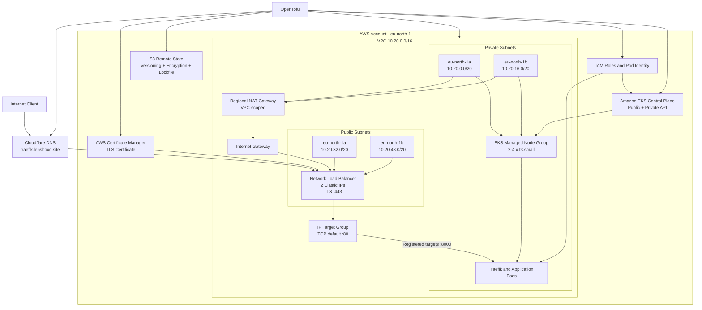
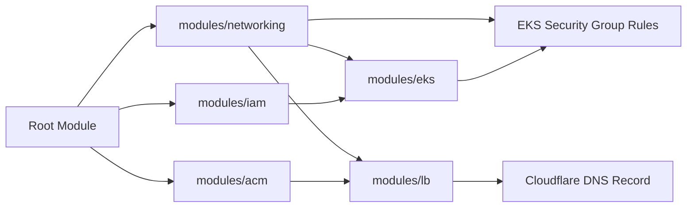

# AWS EKS Provisioning

Folder ini berisi konfigurasi OpenTofu untuk membangun infrastruktur utama
Cloud Engineering Lab di AWS. Stack mencakup remote state, network multi-AZ,
IAM, Amazon EKS, TLS certificate, internet-facing NLB, security group rule, dan
Cloudflare DNS.

Kubernetes workload tidak dikelola dari folder ini. Setelah provisioning selesai,
lanjutkan ke [dokumentasi Kubernetes](../k8s/README.md).

## Arsitektur AWS



Diagram menunjukkan dua jalur yang berbeda:

- Control path: OpenTofu membuat resource AWS dan menyimpan state di S3.
- Data path: client masuk melalui Cloudflare, NLB, Target Group, Traefik, lalu
  aplikasi di EKS.

## Dependensi Module



## Struktur Folder

```text
provision/
|-- bootstrap/
|   `-- main.tf                 # Membuat S3 remote-state bucket
|-- modules/
|   |-- acm/                    # Certificate dan DNS validation
|   |-- eks/                    # Cluster, node group, access, Pod Identity
|   |-- iam/                    # IAM role dan policy
|   |-- lb/                     # NLB, EIP, listener, dan target group
|   `-- networking/             # VPC, subnet, route, IGW, dan NAT
|-- backend.tf                  # Konfigurasi S3 backend
|-- dns.tf                      # CNAME publik menuju NLB
|-- main.tf                     # Komposisi seluruh module
|-- outputs.tf                  # Output lintas tahap deployment
|-- provider.tf                 # AWS dan Cloudflare provider
|-- security-groups.tf          # Ingress NLB ke Traefik
|-- variables.tf                # Input root module
|-- versions.tf                 # Versi OpenTofu dan provider
`-- Makefile                    # Workflow plan, apply, dan destroy
```

## Detail Komponen

### Remote State

Stack `bootstrap` menggunakan local state untuk membuat bucket
`aws-kube-tofu-state-246830848520`. Bucket dikonfigurasi dengan:

- S3 versioning.
- Server-side encryption `AES256`.
- Public access block.
- Bucket owner enforced.
- Policy yang menolak koneksi tanpa HTTPS.
- `force_destroy = false` untuk mencegah penghapusan isi secara tidak sengaja.

Main stack memakai key `aws-kube/dev/eks/terraform.tfstate` dan native S3
lockfile. Jika nama bucket atau state key bootstrap diubah, perbarui juga
`backend.tf`; output bootstrap tidak mengubah backend secara otomatis.

### Networking

| Network | Availability Zone | CIDR | Fungsi |
|---|---|---|---|
| Private subnet A | `eu-north-1a` | `10.20.0.0/20` | EKS node dan Pod |
| Private subnet B | `eu-north-1b` | `10.20.16.0/20` | EKS node dan Pod |
| Public subnet A | `eu-north-1a` | `10.20.32.0/20` | NLB, EIP, dan jalur internet |
| Public subnet B | `eu-north-1b` | `10.20.48.0/20` | NLB, EIP, dan jalur internet |

VPC menggunakan CIDR `10.20.0.0/16`. Kedua private subnet memakai satu
regional NAT Gateway untuk akses keluar. Subnet juga memiliki tag discovery
Kubernetes untuk resource internal dan internet-facing load balancer.

### IAM dan EKS

| Identity | Digunakan oleh | Permission utama |
|---|---|---|
| EKS cluster role | EKS control plane | `AmazonEKSClusterPolicy` |
| EKS node role | Managed node group | Worker, VPC CNI, dan ECR pull policies |
| VPC CNI role | `kube-system/aws-node` | EKS Pod Identity untuk networking Pod |
| Load Balancer Controller role | `kube-system/aws-load-balancer-controller` | EKS Pod Identity untuk registrasi target group |

Konfigurasi cluster saat ini:

| Item | Konfigurasi |
|---|---|
| Nama cluster | `lab-eks` |
| Kubernetes | `1.36` |
| API endpoint | Public dan private |
| Public API allowlist | `cluster_endpoint_public_access_cidrs` |
| Authentication mode | EKS API |
| Node group | Managed, on-demand, AL2023 x86-64 |
| Instance type | `t3.small` |
| Scaling | Minimum 2, desired 2, maksimum 4 |
| Root volume | 20 GiB |

Cluster creator tidak otomatis memperoleh akses administrator. EKS access
entry saat ini memberikan cluster-admin kepada IAM user environment lab yang
didefinisikan pada module EKS. Ganti principal tersebut sebelum digunakan di
account lain.

### TLS, Load Balancer, dan DNS

- ACM membuat certificate untuk `acm_domain_name`.
- Cloudflare DNS record digunakan untuk validasi certificate.
- NLB bersifat internet-facing dan memakai satu Elastic IP per public subnet.
- Listener hanya membuka TLS port `443`.
- TLS policy default adalah `ELBSecurityPolicy-TLS13-1-2-2021-06`.
- Listener meneruskan koneksi ke IP Target Group menggunakan TCP. Target Group
  memiliki default port `80`, sedangkan controller mendaftarkan setiap IP Pod
  Traefik pada resolved target port `8000`.
- `TargetGroupBinding` di Kubernetes mendaftarkan IP Pod Traefik ke Target Group.
- CNAME `traefik.lensboxd.site` mengarah langsung ke DNS NLB dengan proxy
  Cloudflare dinonaktifkan.

Tidak ada listener HTTP port `80`; client harus menggunakan HTTPS.

### Security Group

NLB tidak memakai security group pada desain ini. File `security-groups.tf`
menambahkan ingress TCP port `8000` ke cluster security group dari kedua CIDR
public subnet NLB. Rule ini memungkinkan traffic NLB dan health check mencapai
Pod Traefik.

## Prasyarat

- OpenTofu `>= 1.8.0`.
- AWS CLI profile yang dapat membuat resource VPC, EKS, IAM, ELB, ACM, dan S3.
- Cloudflare API token dengan akses DNS edit untuk zone yang digunakan.
- GNU Make.

Contoh environment lokal:

```bash
export AWS_PROFILE=dev
export CLOUDFLARE_API_TOKEN='<cloudflare-api-token>'
```

Jangan menyimpan token asli di repository.

## Input Environment

Buat `terraform.tfvars` lokal yang tidak di-commit:

```hcl
cluster_name                         = "lab-eks"
cluster_version                      = "1.36"
cluster_endpoint_public_access_cidrs = ["203.0.113.10/32"]
acm_domain_name                      = "traefik.lensboxd.site"
cloudflare_zone_id                   = "<cloudflare-zone-id>"
```

Gunakan public IP administrator sebagai `/32` untuk membatasi akses ke public
Kubernetes API. Jangan memakai `0.0.0.0/0` untuk environment yang tidak memang
membutuhkannya.

## Provisioning

### 1. Bootstrap S3 Backend

Jalankan sekali sebelum inisialisasi main stack:

```bash
cd aws_kube/provision/bootstrap
AWS_PROFILE=dev tofu init
AWS_PROFILE=dev tofu plan -out=bootstrap.tfplan
AWS_PROFILE=dev tofu apply bootstrap.tfplan
```

### 2. Plan Main Stack

Dari folder `aws_kube/provision`:

```bash
make fmt-check
make validate AWS_PROFILE=dev
make plan dev AWS_PROFILE=dev
make show dev
```

Plan disimpan sebagai `plan/dev.tfplan`. Selalu periksa plan sebelum apply.

### 3. Apply Main Stack

```bash
make apply dev AWS_PROFILE=dev
make output AWS_PROFILE=dev
```

Output penting:

| Output | Digunakan untuk |
|---|---|
| `nlb_dns_name` | Target CNAME dan troubleshooting DNS |
| `traefik_target_group_arn` | `TargetGroupBinding` Kubernetes |
| `acm_certificate_arn` | Verifikasi certificate listener NLB |
| `aws_load_balancer_controller_role_arn` | Verifikasi EKS Pod Identity |

### 4. Hubungkan `kubectl`

```bash
AWS_PROFILE=dev aws eks update-kubeconfig \
  --region eu-north-1 \
  --name lab-eks

kubectl get nodes
```

Lanjutkan deployment melalui [`../k8s/README.md`](../k8s/README.md).

## Verifikasi Infrastruktur

```bash
make state-list AWS_PROFILE=dev
make output AWS_PROFILE=dev

AWS_PROFILE=dev aws eks describe-cluster \
  --region eu-north-1 \
  --name lab-eks

AWS_PROFILE=dev aws elbv2 describe-target-health \
  --region eu-north-1 \
  --target-group-arn "$(tofu output -raw traefik_target_group_arn)"
```

Target baru menjadi `healthy` setelah AWS Load Balancer Controller, Traefik,
dan `TargetGroupBinding` selesai di-deploy.

## Destroy

Hapus workload Kubernetes lebih dahulu, lalu buat saved destroy plan:

```bash
make plan-destroy dev AWS_PROFILE=dev
make show-destroy dev
make destroy dev AWS_PROFILE=dev DESTROY_CONFIRM=yes
```

Bucket bootstrap tidak otomatis ikut terhapus. Karena versioning aktif dan
`force_destroy = false`, semua object version dan delete marker harus ditangani
secara sadar sebelum bucket dapat dihapus.

## Catatan Portabilitas

Konfigurasi berikut masih terikat pada environment lab dan harus ditinjau saat
melakukan deployment baru:

- AWS account ID pada state bucket, IAM principal, dan Target Group ARN.
- Region `eu-north-1` pada provider dan backend.
- Domain `traefik.lensboxd.site` pada DNS dan Kubernetes `IngressRoute`.
- Backend bucket dan object key.
- VPC ID pada script instalasi AWS Load Balancer Controller.
- ARN Target Group pada manifest `TargetGroupBinding`.
- Nama NLB `lab-eks-traefik` dan Target Group `lab-eks-traefik-http`.
- Nama IAM role `eks-cluster-role`, `eks-node-role`, dan `eks-vpc-cni-role`.

Resource EKS, NAT Gateway, NLB, EC2 worker node, dan Elastic IP menimbulkan biaya
selama aktif.
